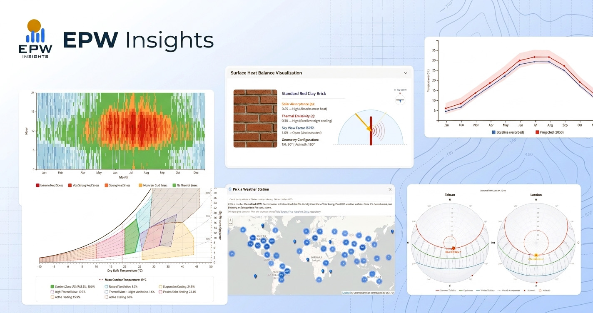

# EPW Insights

[](https://www.gnu.org/licenses/agpl-3.0.html)
[](https://doi.org/10.5281/zenodo.22102742)

A free, browser-based tool for analyzing **EnergyPlus Weather (EPW)** files. Everything runs client-side. Files are parsed and analyzed locally in your browser, nothing is uploaded to a server.

**Live app:** [epwinsights.github.io](https://epwinsights.github.io)

<p align="center">
  
</p>

## Features

- Psychrometric charts with bioclimatic design strategy overlays
- Outdoor thermal comfort analysis (UTCI, SET, MRT)
- Solar radiation, daylight, wind, and material/thermal mass analysis
- Future climate projections to 2030 / 2050 / 2080 under all four SSP scenarios, using the CMIP6/IPCC AR6 morphing method
- Side-by-side comparison of two climate files or scenarios

## Local Development

```bash
npm install
npm run dev      # start local dev server
npm run build    # production build
npx vitest run    # run unit tests
```

## Citing This Software

If you use EPW Insights in academic work, please cite it using the metadata in [`CITATION.cff`](./CITATION.cff), or the DOI above once assigned.

## License

Released under the [GNU AGPL-3.0](https://www.gnu.org/licenses/agpl-3.0.html) license. See [`LICENSE`](./LICENSE) for details.
