# EPW Insights - Validation

Validation of EPW Insights against outside sources, split into two parts
that should be read differently. A third, supplementary section covers
computational performance, a measurement, not a correctness validation,
and is read differently again, see the note at its start.

**UTCI, SET, and MRT** are each checked against an independent, official
reference source: a published dataset, or a reference implementation from
another tool. A low error here is a real correctness claim, since the
app's numbers match what an outside authority says they should be.

**Climate Morphing** is a larger module with several validation layers of
different strength, from unit tests of the pure arithmetic through to a
comparison against an external, officially published archive that never
touched this project's own code or data. Each layer states plainly what
it does and does not prove.

---

## Part 1: Thermal Comfort (UTCI, SET, MRT)

### Method

Every script here imports and executes the actual project source
(`core/outdoor-comfort.js`) unmodified, and no formula is re transcribed
into another language. `core/suncalc.js` is a stub, documented in
comments inside that file, that lets `validate_utci.mjs` and
`validate_set.mjs` import the real module without a live SunCalc
dependency. `validate_mrt.mjs` calls `calculateShortwaveDeltaMRT()`
directly with a solar altitude in radians, so it needs no datetime,
latitude, longitude, or SunCalc stub at all; it is entirely decoupled
from the longwave/ground-temperature side of the module (see "Known
limitations" below for what that side is and is not validated against).

Run `npm run sync:all` before a validation pass to refresh
`core/outdoor-comfort.js`, `state.js`, and the morphing modules from the
live project source, so results always reflect what actually ships.

### Contents

| Metric | Script | Reference | Input (data/) | Output (results/) |
|--------|--------|-----------|----------------|--------------------|
| UTCI | `validate_utci.mjs` | Roman et al. 2026 (10th-degree sparse orthogonal Legendre regression, the algorithm implemented here), tested against Broede et al. 2012 (Zenodo 5503968) independent UTCI-Fiala data, 1000 points | `UTCI-Test-Data.txt` (download separately, see `data/UTCI-Test-Data.README.txt`) | `epwinsights_utci_validation.csv` |
| SET | `validate_set.mjs` | ASHRAE 55-2023 Appendix D4 (22 rows), transcribed directly from the standard's own published table | `epwinsights_set_validation.csv` | `epwinsights_set_validation_rerun.csv` |
| MRT | `validate_mrt.mjs` | ASHRAE 55 Appendix C SolarCal, via `pythermalcomfort.solar_gain()`, SHARP averaged (150 scenarios). Tests `calculateShortwaveDeltaMRT()`, the shortwave-only sub-component of `calculateAdvancedMRT()`, in isolation from the longwave/ground-temperature model | `epwinsights_mrt_validation.csv` | `epwinsights_mrt_validation_rerun.csv` |
| MRT (SolarCal core) | `validate_mrt_c4.mjs` | ASHRAE 55-2023 Table C4-1 (26 rows, seated/standing), transcribed directly from the standard's own published table | `epwinsights_mrt_c4_validation.csv` | `epwinsights_mrt_c4_validation_rerun.csv` |
| MRT (ground surface temperature) | `validate_ground_temp_plausibility.mjs` | No reference standard; a plausibility check, not a validation (see below and "Known limitations") | `epwinsights_14city_peak_ghi_window.csv` | `epwinsights_ground_temp_plausibility.csv` |
| MRT (ground surface temperature, linearization error) | `validate_ground_temp_linearization.mjs` | No reference standard; quantifies the error introduced by the earliest closed form linearization (longwave loss evaluated at air temperature) against the current linearized radiative coefficient (h_r) solve (Walton 1983; ASHRAE 1993 Fundamentals; McClellan and Pedersen 1997), not a validation against an outside source | `epwinsights_14city_peak_ghi_window.csv` | `epwinsights_ground_temp_linearization_error.csv` |
| MRT (ground surface temperature, h_r solve accuracy) | `validate_hr_linearization_accuracy.mjs` | No outside reference source; checks the h_r solve itself against an independent bisection solution of the exact, unlinearized energy balance, across 60,480 synthetic air temperature / wind / surface / radiation / sky-view-factor combinations | none (synthetic grid, generated in script) | `epwinsights_hr_linearization_accuracy.csv`, `epwinsights_hr_linearization_worst_cases.csv` |
| MRT (SHARP-averaging sensitivity) | `validate_sharp_sensitivity.mjs` | No reference standard; a sensitivity analysis, not a validation (see below) | `epwinsights_14city_peak_ghi_window.csv` | `epwinsights_sharp_sensitivity.csv` |

### How to run

```bash
npm run sync:all          # refresh core/outdoor-comfort.js + state.js + morphing modules
npm run validate:all      # UTCI + SET + MRT + SolarCal core (C4)
# or run individually:
# npm run validate:utci
# npm run validate:set
# npm run validate:mrt
# npm run validate:mrt-c4
# npm run validate:hr-linearization
```

Requires Node.js (ESM, no external npm packages). For `validate:utci`,
first download `UTCI-Test-Data.txt` into `data/` (see
`data/UTCI-Test-Data.README.txt`).

### Summary of results

**UTCI (Roman et al. 2026 algorithm) vs. Broede et al. 2012 (1000 point Fiala model dataset)**

This project implements the 10th-degree sparse orthogonal Legendre
regression from Roman et al. 2026, not the original 6th-degree
monomial-basis polynomial published in Broede et al. 2012. Both are
fitted to the same underlying offset dataset, itself derived from the
Fiala multi-node physiological model, but the Legendre-basis version is
substantially more accurate. RMSE = 0.955 C here, after correcting a
single coefficient transcription error where one coefficient was off by
a factor of 10, matching Roman et al.'s own reported RMSE of 0.96 C for
this exact model on this same independent test set (their Table 3,
parenthesized column) almost exactly, and well below the roughly 2.77 C
RMSE they report for the original 6th-degree polynomial on the same
data. R squared = 0.999, Pearson r = 0.9997. The test dataset spans a
154 C range, from -110.87 C to 43.17 C, deliberately covering the
formula's full physical domain, so this range is roughly 160 times the
RMSE. R squared this close to 1 is the expected result of testing across
that wide a range with a small absolute error, not independent evidence
of accuracy beyond the RMSE already stated, see the note at the end of
this subsection for why.

<p align="center">
  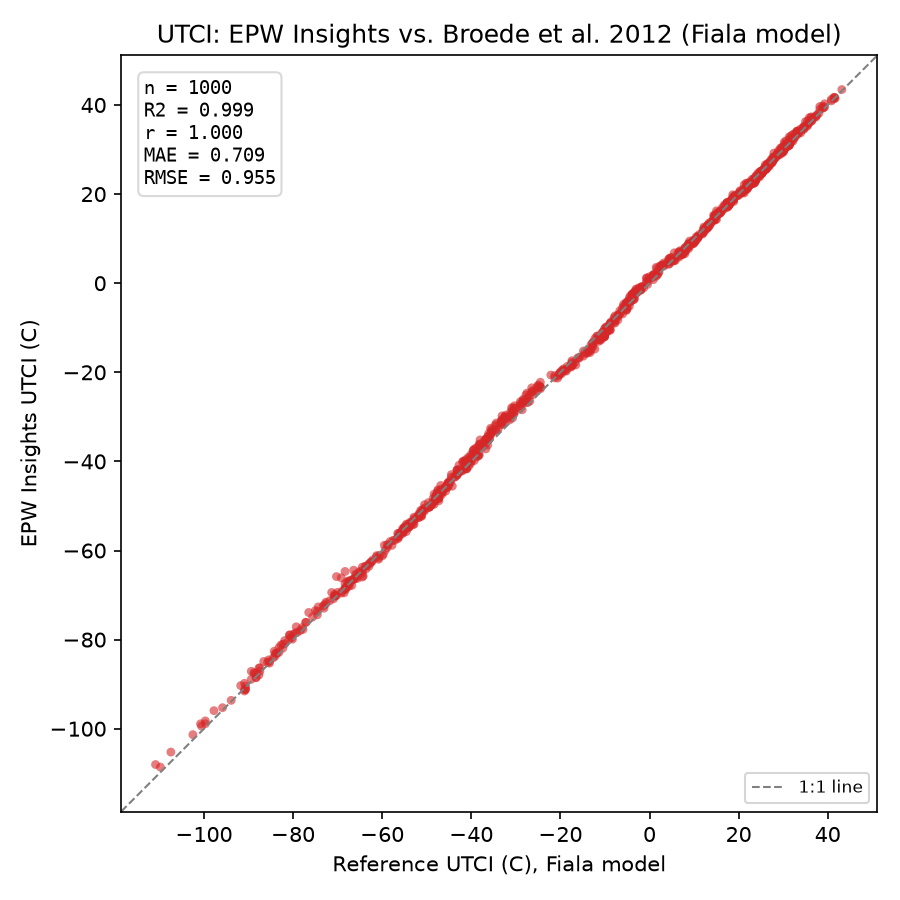
</p>

The Bland-Altman plot below addresses the same range dependent limitation
of R squared directly, by plotting the difference between the two methods
against their mean, instead of one against the other. Bias = 0.215 C,
limits of agreement = -1.610 C to 2.040 C, 1.96 standard deviations either
side of the bias. Both are consistent with the RMSE already reported and
show no trend across the range, no fanning out or narrowing at either
extreme, so the small remaining error does not concentrate in the tails.

<p align="center">
  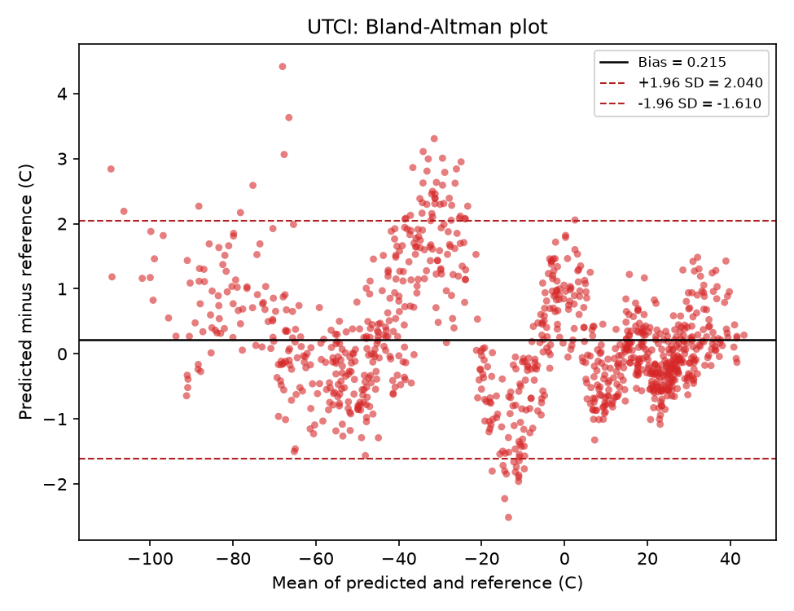
</p>

**SET vs. ASHRAE 55-2023 Appendix D4 (22 reference points)**

| | MAE | RMSE | Max error |
|---|---|---|---|
| Before correction | 0.50 C | 1.43 C | 5.54 C |
| After correction | 0.033 C | 0.042 C | 0.112 C |

Correction: matched three constants that ASHRAE changed between the 2013
and 2023 editions (cDil, the hCc metabolic-convection floor, and
tempCoreNeutral), rather than mixing constants from both. The 2013
Appendix G code (its own Table G-1, not shown here) was checked
independently and reproduces to MAE 0.020 C when its matching constants
are used consistently; this project targets 2023 as the current edition
of the standard. R squared = 0.9998, Pearson r = 0.9999, computed on the
22 point post correction dataset. The test dataset spans 25.4 C, and this
range is roughly 600 times the RMSE, so the same caveat as UTCI applies.

<p align="center">
  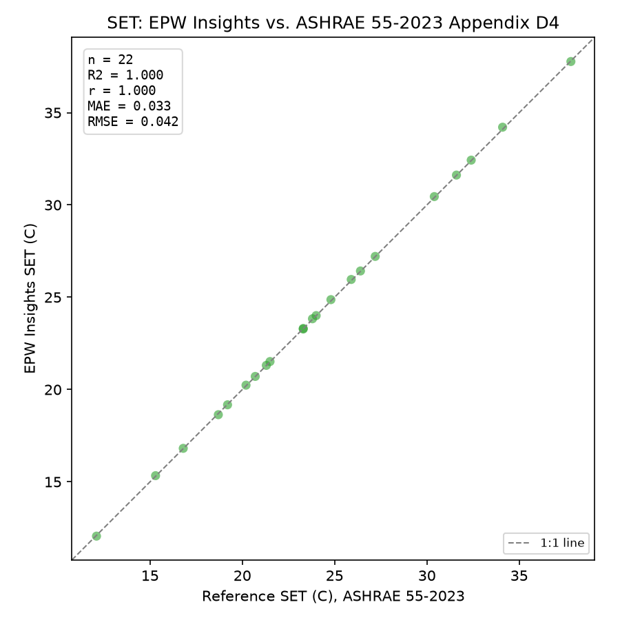
</p>

Bias = 0.017 C, limits of agreement = -0.058 C to 0.091 C. The bias sign
is positive here, EPW Insights runs very slightly warmer than the ASHRAE
table on average, which is not visible from RMSE alone since RMSE cannot
carry a sign; this is the kind of information a Bland-Altman plot adds
that a scatter plot and R squared do not.

<p align="center">
  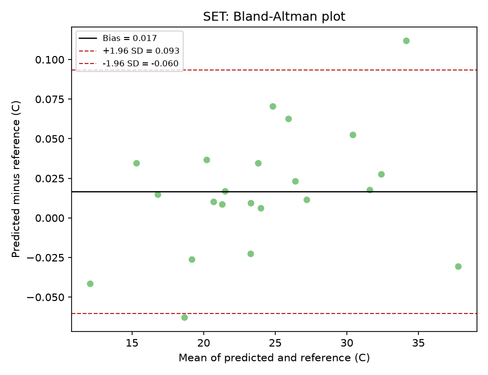
</p>

**MRT (shortwave component) vs. ASHRAE 55 SolarCal (150 scenarios)**

| | MAE | RMSE | Max error |
|---|---|---|---|
| Before correction | 3.43 C | 4.94 C | 13.4 C |
| After correction | 0.001 C | 0.0014 C | 0.005 C |

Correction: added the missing body surface radiant exposure fraction
(f_eff = 0.725 standing, 0.696 seated), corrected the linearized radiative
heat transfer coefficient (6.0 W/m2K, was 4.7), and replaced the altitude
only projected area factor approximation with a SHARP averaged
interpolation of the standard's own lookup table. Remaining error is
interpolation noise, not a physical discrepancy. R squared and Pearson r
both round to 1.000 on the post correction dataset. The test dataset
spans 61.3 C, roughly 44000 times the RMSE, the widest ratio of the three
metrics in this part.

*Isolation methodology (updated after the ground surface temperature fix
below).* This table was originally produced by calling
`calculateAdvancedMRT()` twice per scenario (once with solar radiation
zeroed out, once with the real value) and subtracting, relying on the
longwave term being identical in both calls. Once ground surface
temperature became a function of solar radiation (see "Known
limitations"), that assumption no longer held, so the shortwave
computation was factored out into its own function,
`calculateShortwaveDeltaMRT()`, and this script now calls it directly.
Re running the validation against the refactored source reproduces the
same 150 per-row values to four decimal places as before the refactor;
the numbers above are unchanged.

<p align="center">
  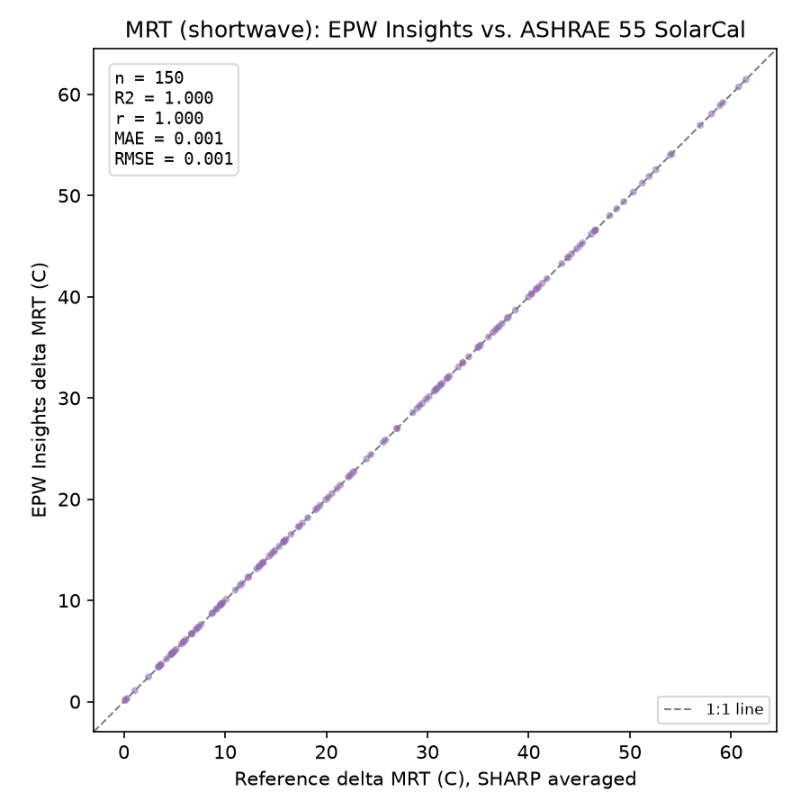
</p>

Bias = 0.0004 C, limits of agreement = -0.0023 C to 0.0031 C, both three
orders of magnitude below a typical delta MRT value in this dataset,
consistent with interpolation noise rather than a physical discrepancy.

<p align="center">
  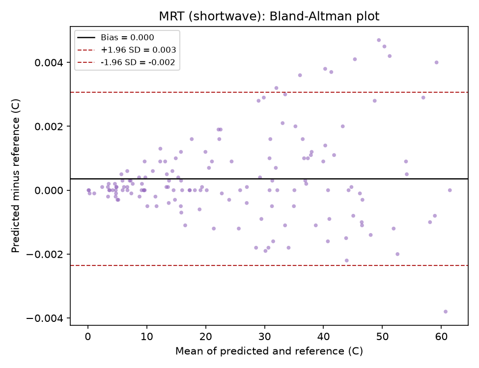
</p>

**SolarCal core (ERF, t_rsw) vs. ASHRAE 55-2023 Table C4-1 (26 reference points)**

This is a separate, independent check on the underlying SolarCal formula
itself, using the standard's own validation table rather than a
third-party library. It covers the raw `ERF()`/`get_fp()` functions
(Appendix C4), not `calculateAdvancedMRT()` end to end, since every row
in Table C4-1 uses `tsol < 1` and `fbes < 1` (an indoor, behind-glass
scenario), while the outdoor-adapted function in this project fixes both
at 1 (no glazing) and cannot be exercised by this table directly.

| | MAE | RMSE | Max error | Bias | Limits of agreement |
|---|---|---|---|---|---|
| ERF (W/m^2) | 0.026 | 0.028 | 0.047 | -0.011 | -0.063 to 0.041 |
| t_rsw (C) | 0.026 | 0.029 | 0.046 | +0.001 | -0.055 to 0.058 |

26 of the table's 29 rows are used (seated and standing; the 3
"horizontal" posture rows require an additional alt/sharp transform not
implemented here). Errors are at the rounding precision of the published
table itself (one decimal place), i.e. this is an exact reproduction, not
an approximation. Bias for both sub-metrics is near zero and consistent
with that same rounding-precision noise, not a systematic offset.

<p align="center">
  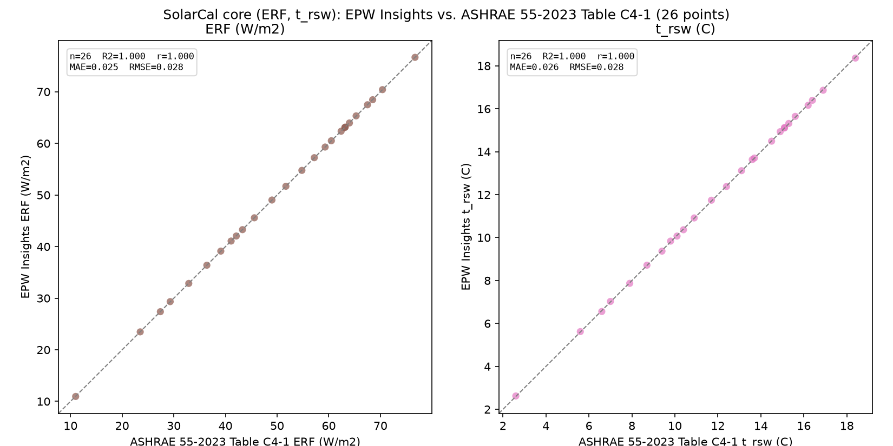
</p>

<p align="center">
  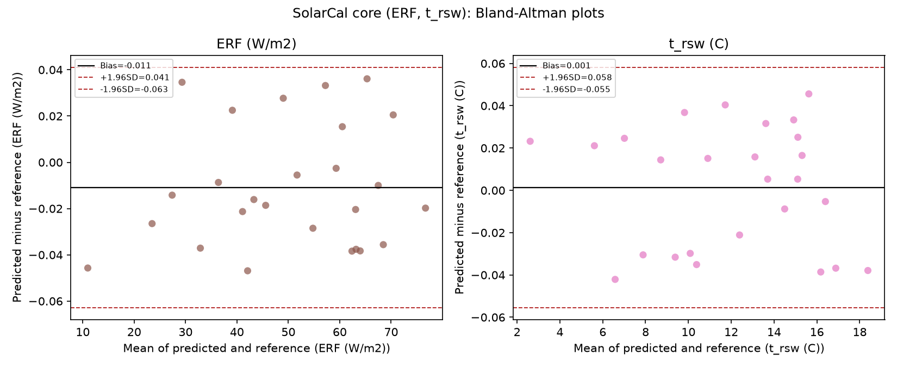
</p>

This script also confirms, separately, that the project's own
SHARP-averaged `fp` constants (`FP_SHARP_AVG_STANDING` /
`FP_SHARP_AVG_SEATED` in `core/outdoor-comfort.js`, used by
`calculateShortwaveDeltaMRT()` for the unknown-pedestrian-orientation
case) are the exact trapezoidal average, over the full 0-180 deg SHARP
range, of the same official `fp` lookup table used above: max difference
across all 14 values (7 altitudes x 2 postures) is 0.0000.

**Why R squared and Pearson r are reported but not treated as the primary
accuracy claim.** All four test datasets (UTCI, SET, MRT, and SolarCal
core, the last split into ERF and t_rsw) were deliberately built to span
each formula's full physical domain, from severe cold to severe heat for
UTCI, a wide skin temperature relevant range for SET, the full range of
solar altitude and irradiance for MRT, and the full range of Table
C4-1's own input variables for SolarCal core, precisely so that a
transcription error anywhere in the formula would be caught somewhere in
the sweep. That same design choice means the variance of the reference
values across the test set is two to four orders of magnitude larger than
the residual error of a broadly correct implementation, so R squared and
Pearson r are mathematically close to 1 for any implementation that is
not fundamentally broken, correct or with a small remaining bug alike.
This is the same reasoning Bland and Altman gave in 1986 against relying
on a correlation coefficient to judge agreement between two methods,
since a high correlation mostly reflects a wide range of true values
being tested, not numerical closeness (<a href="https://doi.org/10.1016/S0140-6736(86)90837-8" target="_blank" rel="noopener noreferrer">Bland & Altman, 1986</a>). The MAE, RMSE, and max error
figures already given for each metric are the ones that carry the actual
accuracy claim. R squared and r are reported alongside them because
reviewers expect to see them next to a predicted versus reference
scatter plot, and because a value noticeably below 1 would still be a
useful warning sign, not because a value at or near 1 is itself proof of
correctness. The Bland-Altman plot given for each metric is the more
appropriate tool for the actual agreement question, since it plots the
difference between the two methods directly rather than one against the
other, and its bias and limits of agreement carry sign and scale
information that R squared discards entirely.

All five R squared and Pearson r values above (UTCI, SET, MRT, SolarCal
core ERF, SolarCal core t_rsw), and all eight figures for this part, four
scatter plots and four Bland-Altman plots, are computed
directly from the existing `results/*.csv` files by `generate_figures.py`,
described in the appendix, not read off the tables by hand. Re running
any of the four `validate_*.mjs` scripts and then `generate_figures.py`
regenerates the numbers and every figure together, so they cannot drift
out of sync with each other.

**MRT (ground surface temperature) plausibility check across 14 cities**

There is no field-measured ground surface temperature dataset available
for this project, so the sol-air ground surface temperature model
(`getGroundSurfaceTemperature()`, which replaced an earlier Tg = Ta
assumption) cannot be validated the way UTCI, SET, and MRT shortwave are
above. What `validate_ground_temp_plausibility.mjs` checks instead is
plausibility: run on real EPW data across 14 climatically diverse cities
(the same 14 used in Part 2, Climate Morphing), does the model produce a
ground-air temperature difference (Tg minus Ta) of a physically
reasonable, climate-responsive order of magnitude, rather than an
implausible or erratic one.

For each city, the 11:00-15:00 local standard time window of the single
day with the highest hourly Global Horizontal Radiation in the EPW file
was extracted (`extract_peak_ghi_window.ps1`), and Tg minus Ta was
computed for each of those 5 hours using the platform's default ground
surface material (aged concrete paving, alpha = 0.35, epsilon = 0.90).

| City | Koppen | Mean Ta (C) | Mean Tg (C) | Mean deltaT (C) | Range deltaT (C) |
|---|---|---|---|---|---|
| Moscow | Dfb | 25.3 | 37.7 | 12.4 | 11.0 to 13.3 |
| Phoenix | BWh | 39.2 | 51.3 | 12.0 | 7.4 to 17.0 |
| Santiago | BSk | 25.9 | 36.6 | 10.7 | 8.6 to 12.0 |
| Sydney | Cfa | 29.5 | 39.8 | 10.3 | 6.5 to 13.6 |
| Mumbai | Aw | 33.7 | 43.1 | 9.3 | 8.4 to 10.3 |
| Rio de Janeiro | Am | 26.6 | 35.5 | 8.8 | 5.9 to 10.6 |
| Cairo | BWh | 39.5 | 48.0 | 8.4 | 6.5 to 10.5 |
| Tehran | BSk | 34.9 | 43.0 | 8.1 | 6.3 to 10.5 |
| Singapore | Af | 30.7 | 38.4 | 7.7 | 0.9 to 10.3 |
| Chicago | Dfa | 22.8 | 29.6 | 6.9 | 5.3 to 8.0 |
| London | Cfb | 27.6 | 33.7 | 6.1 | 5.0 to 7.2 |
| Nairobi | Cwb | 22.6 | 28.1 | 5.5 | 4.4 to 7.0 |
| Ulaanbaatar | Dwb | 13.5 | 19.1 | 5.5 | 4.4 to 6.0 |
| Rome | Csa | 23.4 | 28.5 | 5.1 | 4.5 to 5.5 |

Mean of the 14 city means: 8.3 C. Range of city means: 5.1 C (Rome, Csa) to 12.4 C 
(Moscow, Dfb). This spread reflects genuine climate and
solar-intensity differences rather than model instability: cooler,
cloudier, or higher-altitude climates (Rome, London, Nairobi,
Ulaanbaatar) show the smallest differences, while hot, dry climates
(Phoenix, Cairo) and calm-wind conditions specifically (Moscow, at only
1.0 m/s during the extracted window) show the largest, consistent with
field observations that pavement in calm weather can be an additional 3
to 10 C hotter than in windy weather, and that air temperature and solar
irradiance are the dominant external drivers of pavement surface
temperature (<a href="https://doi.org/10.1007/s11356-022-22295-3" target="_blank" rel="noopener noreferrer">Qin et al., 2022</a>). An earlier iteration of this check used a grass/soil
ground preset and found implausibly large differences (up to 68 C) under
calm, high-radiation conditions; this was traced to the sol-air model's
lack of an evapotranspiration term, an effect that matters for vegetated
surfaces but not for dry, impermeable pavement, so the platform's default
ground surface material was changed to aged concrete paving, for which
the model's dry heat-balance assumptions are appropriate.

**MRT (ground surface temperature, linearization error) across 14 cities**

Ground surface temperature (T_g) is a steady-state sol-air energy balance
where the longwave loss term depends on the surface temperature being
solved for, so it cannot be solved in one algebraic step without either an
approximation or an iterative solve. This project went through three
stages before its current method: an initial version assumed T_g = T_air
outright, with no longwave exchange at all; a second version broke the
circularity by evaluating the longwave loss at air temperature instead of
surface temperature, a standard hand-calculation simplification accurate
only when T_surf stays close to T_air; a third, intermediate version
replaced that with a plain, fixed 5-iteration fixed-point substitution,
which removed the air-temperature bias in typical conditions but was
later found, in low-wind/high-radiation/dark-surface conditions, to
itself under-converge by up to several degrees C relative to a fully
converged solution (superseded before publication; not included in this
repository). The current implementation solves the same balance with the
linearized radiative heat transfer coefficient (h_r) method used for the
exterior surface heat balance in EnergyPlus (Walton 1983, Thermal
Analysis Research Program Reference Manual, NBSSIR 83-2655; ASHRAE 1993
Handbook of Fundamentals; McClellan and Pedersen 1997, ASHRAE
Transactions 103(2):469-484): the quartic loss term is rewritten with the
exact algebraic identity T^4_surf - T^4_sky = (T_surf - T_sky)(T_surf +
T_sky)(T^2_surf + T^2_sky), so the loss is exactly h_r times a linear
temperature difference; h_r is recomputed from each new surface
temperature estimate and the linear balance re-solved until the surface
temperature changes by less than 0.001 C between iterations. See "MRT
(ground surface temperature, h_r solve accuracy)" below for an
independent check of this method's own convergence and accuracy.

`validate_ground_temp_linearization.mjs` reproduces the earliest
(air-temperature) closed-form formula inline and compares it, city by
city, against the current, h_r-linearized implementation.

Across the same 14-city, 11:00-15:00 LST midday window used above, the 
mean error (old minus new) is positive for every city, ranging from 0.702 C
(Ulaanbaatar) to 6.843 C (Moscow), with a mean of the 14 city means of 2.541 C.
This one directional pattern matches the bias the earliest linearization would be
expected to produce: because the surface is warmer than the air through most of 
this midday window, evaluating the longwave loss at the cooler air temperature 
under uses the true radiative loss, systematically inflating the closed form 
T_surf relative to the iterative solve. The largest single hour error found 
across all 14 cities x 5 hours is 11.060 C (Phoenix). The current implementation 
replaces the closed form with the h_r-linearized iterative solve, removing this 
error going forward; the comparison exists to document the size of what was fixed.

**MRT (ground surface temperature, h_r solve accuracy)**

`validate_hr_linearization_accuracy.mjs` checks the h_r-linearized solve
itself, independently of any EPW data, against a bisection solution of
the exact, unlinearized residual across a synthetic 60,480-combination
grid: air temperature -15 to 50 C, dew-point depression up to 45 C (sky
temperature derived the same way as the rest of the platform), wind 0 to
15 m/s, surface absorptance 0.15 to 0.97, emissivity 0.85 to 0.98,
incident radiation 0 to 1300 W/m2 (beyond any real terrestrial value, to
stress the method past what real EPW data will ever produce), and sky
view factor 0.2 to 1.0. Bisection shares no formula or code with the h_r
method, so it cannot reproduce a systematic error the h_r method might
have.

| Wind band | Surface | n | Mean error (C) | Max error (C) |
|---|---|---|---|---|
| Calm (<=1 m/s) | Light (alpha<=0.35) | 10368 | 0.000010 | 0.000103 |
| Calm (<=1 m/s) | Medium (0.35<alpha<=0.65) | 5184 | 0.000022 | 0.000161 |
| Calm (<=1 m/s) | Dark (alpha>0.65) | 10368 | 0.000033 | 0.000234 |
| Moderate (1-5 m/s) | Light (alpha<=0.35) | 6912 | 0.000003 | 0.000041 |
| Moderate (1-5 m/s) | Medium (0.35<alpha<=0.65) | 3456 | 0.000007 | 0.000068 |
| Moderate (1-5 m/s) | Dark (alpha>0.65) | 6912 | 0.000008 | 0.000099 |
| Windy (>5 m/s) | Light (alpha<=0.35) | 6912 | 0.000001 | 0.000013 |
| Windy (>5 m/s) | Medium (0.35<alpha<=0.65) | 3456 | 0.000001 | 0.000012 |
| Windy (>5 m/s) | Dark (alpha>0.65) | 6912 | 0.000001 | 0.000012 |

The largest error across all 60,480 combinations is 0.000234 C (calm
wind, dark surface, at the coldest/driest/highest-radiation corner of the
grid), converging in 12 iterations or fewer everywhere. Error grows with
lower wind and darker surfaces, matching where h_r itself changes most
between iterations, but stays several orders of magnitude below the
0.01 C precision the rest of this validation targets, even at
combinations well outside what real EPW files produce.

**MRT (SHARP-averaging sensitivity) across 14 cities**

`calculateShortwaveDeltaMRT()` defaults to a SHARP-averaged projected area
factor (fp) because a pedestrian's facing direction is not knowable from
EPW data alone. As of this version, the platform also accepts a known,
fixed facing direction (a compass bearing) for cases where the user does
know the orientation of the space being analyzed (a street, plaza, or
building facade); when set, the exact ASHRAE 55-2023 Table C-3 fp for
that orientation and the hour's actual sun position is used instead
(`getFp()`, transcribed from and validated against the same table as
`getFp()` in `validate_mrt_c4.mjs`).

`validate_sharp_sensitivity.mjs` quantifies how much the two can differ,
using the same 14-city, 11:00-15:00 LST midday-window dataset as the
ground surface temperature check above. For each city-hour, the default
(SHARP-averaged) shortwave delta-MRT is compared against the true
best-case and worst-case values a fixed facing direction could produce,
found by sweeping 72 candidate orientations (every 5 degrees) through the
same, real solar position for that hour.

| City | Koppen | Averaged (default) | Worst-case | Best-case | Worst - averaged | Averaged - best |
|---|---|---|---|---|---|---|
| Ulaanbaatar | Dwb | 63.0 | 66.7 | 59.8 | 3.7 | 3.2 |
| Moscow | Dfb | 59.0 | 62.2 | 56.0 | 3.2 | 3.0 |
| Rome | Csa | 62.8 | 66.0 | 60.1 | 3.2 | 2.6 |
| London | Cfb | 58.0 | 61.2 | 55.2 | 3.2 | 2.8 |
| Sydney | Cfa | 65.5 | 68.4 | 63.3 | 2.9 | 2.2 |
| Cairo | BWh | 62.2 | 65.1 | 60.0 | 2.9 | 2.2 |
| Chicago | Dfa | 61.1 | 63.9 | 58.9 | 2.8 | 2.2 |
| Santiago | BSk | 66.1 | 68.9 | 64.0 | 2.8 | 2.1 |
| Singapore | Af | 54.7 | 56.9 | 52.8 | 2.2 | 1.9 |
| Tehran | BSk | 74.2 | 76.1 | 72.7 | 2.0 | 1.5 |
| Rio de Janeiro | Am | 61.9 | 63.7 | 60.5 | 1.8 | 1.3 |
| Mumbai | Aw | 61.9 | 64.3 | 60.1 | 2.4 | 1.8 |
| Phoenix | BWh | 71.2 | 73.6 | 69.3 | 2.4 | 1.8 |
| Nairobi | Cwb | 64.0 | 65.7 | 62.7 | 1.6 | 1.3 |

Mean across the 14 cities: the true worst-case orientation reaches 2.7 C
higher shortwave delta-MRT than the SHARP-averaged default, and the true
best-case orientation is 2.1 C lower. This is a modest spread relative to
the shortwave delta-MRT values themselves (55 to 74 C at midday), and
supports SHARP-averaging as a reasonable simplification for the
unknown-orientation case, while still giving users with a known
orientation a way to obtain the exact value rather than the averaged one.

### Known limitations

- MRT longwave component (sky and ground radiant exchange) has no official
  reference standard, and is not numerically validated against an
  independent dataset here. Sky temperature is derived from EPW horizontal
  infrared radiation via the Stefan Boltzmann law (falling back to a
  Clark and Allen 1978 dew-point-based clear-sky estimate when that field
  is unavailable), blended with ground temperature via Sky View Factor.
- Ground surface temperature is estimated with a sol-air temperature model
  (ASHRAE Fundamentals, McAdams 1954 convection coefficient), driven by a
  user-selectable ground surface material, rather than assumed equal to
  air temperature. This replaces an earlier version of the module that
  used Tg = Ta, a simplification that omits daytime longwave exchange
  entirely. The longwave loss term is solved by the linearized radiative
  heat transfer coefficient (h_r) method used for the exterior surface
  heat balance in EnergyPlus (Walton 1983; ASHRAE 1993 Fundamentals;
  McClellan and Pedersen 1997), rather than the closed form linearization
  (loss evaluated at air instead of surface temperature) used in an
  earlier version of this module; see the linearization error
  quantification above for the size of that earlier approximation's
  error, and the h_r solve accuracy check above for an independent check
  of the current method itself. The current model has no field dataset of
  measured ground surface temperature to
  validate against either; what is checked instead is the 14 city
  plausibility comparison reported above, which is evidence the model
  responds sensibly to climate and radiation intensity, not a substitute
  for field or model to model validation.
- The shortwave projected area factor (fp) is averaged over the full 0-180
  deg SHARP range by default, because a pedestrian's facing direction is
  not knowable from EPW data alone. The 14-city sensitivity check reported
  above found this averaging differs from the true worst-case orientation
  by 2.7 C and from the true best-case orientation by 2.1 C, on average, in
  shortwave delta-MRT, a modest spread relative to the 55-74 C shortwave
  delta-MRT values themselves. Users who do know the orientation of the
  space being analyzed can set a fixed facing direction (`facingAzimuth`
  in `humanParams`, or the "Facing Direction" control in the Outdoor
  Comfort tab) to use the exact ASHRAE Table C-3 fp instead.
- Diffuse solar radiation: EPW Insights uses the EPW file's actual measured
  diffuse horizontal radiation instead of ASHRAE 55's cruder 0.2 times
  direct building design estimate. This is a deliberate improvement, not a
  deviation from the reference.
- No independent field validation, such as globe thermometer measurements
  like Middel's MaRTy, or comparison against a full independent
  microclimate model such as SOLWEIG or UMEP, was performed for either the
  sky or ground longwave terms. Suggested as future work.

---

## Part 2: Climate Morphing

### Overview

The Climate Morphing module takes a user's uploaded EPW file, a historical
or typical year record, and produces a projected version of its hourly
dry bulb temperature series for a chosen future SSP scenario and reference
period, using gridded CMIP6 temperature deltas at the nearest 1 by 1
degree land grid cell to the station. The morphed series feeds the app's
existing downstream comfort and degree day analyses, so those can be re
run as if against a future climate.

Only dry bulb temperature is morphed in the current phase. Humidity,
radiation, and wind are left unchanged, a known and explicitly documented
scope limitation, see section 11.

This part of the document is organized in two halves. The first half
describes what the module does and how the underlying CMIP6 dataset is
built and deployed. The second half covers every validation layer
performed against it, from unit tests of the pure arithmetic through to a
comparison against an external archive.

### 1. Data Source

- Dataset: Copernicus Interactive Climate Atlas gridded CMIP6 dataset, the
  no bias adjustment variant.
- DOI: 10.1038/s41597-022-01739-y
- Format as obtained: NetCDF, 1 by 1 degree global grid, monthly frequency,
  per model ensemble member, not a pre aggregated multi model mean
  product.
- Reference repository for auxiliary data and methodology:
  SantanderMetGroup/ATLAS on GitHub, specifically the `reference-grids`
  folder, the source of the land mask described in section 2, and the
  `reference-regions` folder, the source of the IPCC AR6 46 region
  polygons, used in this module only as a descriptive UI label.

### 2. Land Mask

The 1 by 1 degree CMIP6 grid cells are filtered to land only cells using
the ATLAS `reference-grids/land_sea_mask_1degree_binary.nc4` file, WFDE5
and ERA5 derived, at a 0.5 or greater land fraction threshold.

This yields 24257 land cells out of 64800 global cells, about 37 percent.
This figure was cross validated against an independent global land mask,
GSHHG based, check. The 37 percent figure is higher than the commonly
cited 29 percent area weighted land fraction of Earth because a plain
cell count, not area weighted, over represents high latitudes, where 1 by
1 degree cells cover less physical area.

An earlier attempt used the IPCC AR6 46 region polygons themselves as the
land or sea filter. This produced a physically implausible 50 percent
land cell count and was abandoned in favor of the dedicated land mask
above. The AR6 polygons are retained only for the descriptive region name
label shown in the UI, and never feed the land filter or the morphing
calculation itself.

### 3. Baseline and Reference Periods

The baseline period is 1995 to 2014, the CMIP6 and AR6 standard recent
past reference, not the pre industrial 1850 to 1900 baseline. This is
chosen because EPW files represent modern era climate, so deltas are
computed relative to a comparably modern reference.

Three discrete future reference periods are used, with no interpolation
between them:

| UI label | AR6 term | 20 year window |
|---|---|---|
| 2030 | Near term | 2021 to 2040 |
| 2050 | Mid term | 2041 to 2060 |
| 2080 | Long term | 2081 to 2100 |

Each period is an independently computed 20 year CMIP6 ensemble
climatology. There is intentionally no continuous year slider and no
linear interpolation between periods or scenarios, since a single GCM
year's output is dominated by internal variability, such as ENSO,
volcanic forcing, and stochastic noise, not the climate signal, so
morphing to a specific intermediate year would imply a precision the data
does not support. This matches standard climatology practice and the same
roughly 20 year averaging window an EPW or TMY file itself already uses
in its own construction.

This same internal variability behavior was directly observed during the
independent extraction cross check described in section 14. Near term SSP
ordering can be non monotonic for exactly this reason, and this pattern
disappears by 2080, see section 14.4.

### 4. Ensemble Aggregation

For each variable, SSP, and period combination, the mean and standard
deviation are computed across all available CMIP6 ensemble members,
independently for the historical or baseline period and for each future
SSP and period. The delta is the future period ensemble mean minus the
baseline ensemble mean.

Ensemble sizes legitimately differ between the historical run, roughly 30
members, and individual SSP runs, roughly 16 to 27 members, since not
every GCM in the archive ran every scenario. No member to member pairing
across historical and future runs is attempted or needed for this design.

The ensemble standard deviation is computed and carried through the data
pipeline and the client side data loading API, but is not yet consumed by
the morphing calculation itself, since `morphHourlyTemperature` only
applies the ensemble mean. The monthly chart in the UI does render a
shaded band derived from this standard deviation, but it should be read
as the inter ensemble member spread, not a formal statistical confidence
interval. A proper uncertainty aware morphing treatment is a documented
future phase item, not yet implemented.

### 5. Morphing Method: Shift and Stretch

The hourly dry bulb temperature series is morphed using a Shift and
Stretch method, CIBSE style, not a shift only method:

1. Shift: each day's mean temperature is shifted by that month's ensemble
   mean delta tas.
2. Stretch: the diurnal anomaly, each hour's departure from its own day's
   mean, is additionally scaled by the change in diurnal temperature
   range implied by delta tasmax minus delta tasmin, relative to the
   station's own historical diurnal temperature range for that month.

Two numerical safeguards were added for implementation robustness, and
are not part of the CIBSE method itself:

- Stretch factor is clamped to the range 0.1 to 3.0.
- If a month's historical diurnal temperature range is below 0.1 degrees,
  numerically unstable to scale, the stretch factor falls back to 1,
  shift only, for that month only.

Both bounds are pinned by the unit tests described in section 13, so any
future change to these constants will surface as a test failure rather
than silently changing behavior.

The classic Belcher, Hacker,
and Powell 2005 Shift and Stretch formulation measures each hour's
anomaly against its monthly mean. This implementation measures it against
each hour's own daily mean instead, while still deriving the stretch
factor from the monthly delta diurnal temperature range. This preserves a
more realistic day to day diurnal cycle but is a deliberate elaboration
of, not a direct transcription of, the textbook formula. The arithmetic
for this exact variant is confirmed correct in section 13.1. This is a
documentation note, not an open question.

### 6. Variable Scope

Morphed: `tas`, `tasmax`, `tasmin`, monthly deltas, used to compute the
hourly Shift and Stretch above.

Retrieved for independent benchmark validation only, not used to morph
the EPW but compared against EPW derived deltas as a sanity check, see
the in app independent benchmark panel and section 16: eight CMIP6 index
variables.

| Index | Meaning | Monthly aggregation to annual |
|---|---|---|
| CDD | Cooling Degree Days | Direct annual mean |
| HDD | Heating Degree Days | Direct annual mean |
| TX35 | Days with Tmax above 35 C | Sum of 12 months to annual, mean across years |
| TX40 | Days with Tmax above 40 C | Sum of 12 months to annual, mean across years |
| FD | Frost Days, Tmin below 0 C | Sum of 12 months to annual, mean across years |
| Tropical Nights | Days with Tmin at or above 20 C | Sum of 12 months to annual, mean across years |
| TXx | Annual max of monthly Tmax | Max of 12 months to annual, mean across years |
| TNn | Annual min of monthly Tmin | Min of 12 months to annual, mean across years |

TXx and TNn are explicitly non linear, not summable or reconstructable
from monthly means. This drove a dedicated annual max and annual min
aggregation mode in the extraction script, section 8, distinct from the
annual sum mode used for the day count indices.

Explicitly deferred to a future phase: humidity, radiation, and wind
morphing. Leaving these fields unchanged while temperature shifts becomes
physically inconsistent at larger deltas, a known and documented
limitation, see section 11.

### 7. Precision and Encoding

- Delta values are rounded to 1 decimal place, 0.1 C precision, comfortably
  within CMIP6 model uncertainty.
- Values are quantized to Int8 or Int16 with a per field scale factor,
  target scale 10.0, meaning 0.1 precision, auto reduced only when
  necessary to avoid Int16 clipping. Some HDD fields in cold or late
  scenarios legitimately use a scale below 10, a wider dynamic range
  needed for that field by design, not a bug, and this is explicitly re
  verified by the validation scripts in section 16.
- Nodata sentinels: -128 for Int8, -32768 for Int16.

### 8. Pipeline: NetCDF to Browser Ready Tiles

```
Raw CMIP6 NetCDF, per variable, per SSP or historical
   extract_climate_deltas.py
      multi mode: monthly, annual, annual sum, annual max, annual min
      uses land_sea_mask_1degree_binary.nc4, section 2, as the land filter
      compares baseline 1995 to 2014 against each future period, section 3
   produces
132 per variable, per SSP, per period JSON delta files
   11 variables times 4 SSPs times 3 periods

   merge_deltas.py
      dedupes the shared 24257 cell latitude and longitude list into one
      grid index, splits output per SSP and period, not per variable
      family, to keep individual file sizes manageable
   produces
climate-grid-index.json plus 12 climate-temp files plus 12 climate-indices
files, one pair per SSP and period combination

   build_climate_tiles.py
      single script, three internal stages, each to its own subfolder
      under --output-dir, also individually re runnable via
      --only reduce, --only binarize, or --only tile

      01_rounded    round all deltas to 1 decimal, section 7
      02_binary     Int8 or Int16 quantization, per field auto scale
      03_tiles      adaptive k-d tree tiling, merges all 24 bases per tile
   produces
03_tiles, production ready, copied into public/data/climate/tiles/
   tile-index.json
   climate-grid-index.tileNN.i16.bin and matching manifest.json, per tile,
   latitude and longitude only
   data.tileNN.i8.bin, i16.bin, and matching manifest.json, per tile, all
   24 SSP and period bases
   result: 27 tiles, 136 files total
```

The four SSP scenarios covered are SSP1-2.6, SSP2-4.5, SSP3-7.0, and
SSP5-8.5, giving 4 scenarios times 3 periods times 2 variable families
equals 24 bases per tile.

Earlier documentation of this pipeline referred to three separate scripts,
`step1_reduce_precision.py`, `step2_binarize.py`, and `tile_merged_v6.py`,
for the three stages shown above. These have since been consolidated into
the single `build_climate_tiles.py`, which is what actually ships in the
repository today.

The extraction stage went through several iterations before reaching its
current form, described in full in section 17, since the history is worth
recording but is not needed to understand how the pipeline works today.

### 8.1 Reproducing the Pipeline in One Command

`build_climate_database.py` is the single entry point for rebuilding this
entire database from raw NetCDF, for anyone who needs to either
regenerate it from an updated CMIP6 release or independently verify how
it was produced.

It orchestrates the three scripts above as subprocesses, without
duplicating any of their internal logic. It only handles locating the
right NetCDF files by the project's folder and naming convention,
building each script's argument list correctly, including `--mode`, whose
omission caused the bug described in section 17, and wiring each stage's
output directory into the next stage's input.

```bash
python build_climate_database.py \
    --netcdf-root /path/to/CMIP6/nc \
    --land-mask /path/to/land_sea_mask_1degree.nc4 \
    --output-root /path/to/build_output
```

produces

```
build_output/
    00_extracted     132 raw delta JSON files
    01_merged        climate-grid-index.json plus climate-temp and
                      climate-indices files
    02_tiles/
        01_rounded
        02_binary
        03_tiles      copy this into public/data/climate/tiles/
```

A single stage can be re run in isolation, reusing previous stages'
output already on disk, for example after changing a tiling parameter.

```bash
python build_climate_database.py --output-root ./build --only tiles
```

`build_climate_database.py` must sit in the same folder as
`extract_climate_deltas.py`, `merge_deltas.py`, and
`build_climate_tiles.py`, or pass `--scripts-dir`, see the appendix for
the recommended repository layout.

### 9. Tiling and File Delivery Architecture

Rather than one or a few monolithic files, tens of megabytes, all
downloaded up front, or one file per region and scenario, thousands of
tiny files, the delivered dataset uses geographic tiling.

Adaptive k-d tree partitioning recursively median splits cells on
whichever axis, latitude or longitude, currently has the larger span,
until each leaf tile holds at most 1500 cells, the target maximum. Split
boundaries are inherited exactly from the parent bounding box, not from
the minimum and maximum of the points inside it, so the tiling covers the
entire globe with no gaps or overlaps. Every coordinate, not just
existing cells, belongs to exactly one tile.

A fixed size latitude and longitude box approach was tried first. Because
land is clustered rather than uniformly distributed, this produced 67
very uneven tiles, most far under the 1500 cell cap, and was abandoned in
favor of the adaptive approach.

Per tile file bundling packs all 24 SSP and period bases, 12 temperature
plus 12 index combinations, into one combined data file per tile, instead
of one file per tile per base, cutting file count by a factor of 24.

The actual result on the production dataset is 27 tiles, with a maximum of
1492 cells, a minimum of 725, and a mean of 898, against a cap of 1500,
for a total of 136 files, calculated as the number of tiles times 5 plus
1, one grid bin file, one grid manifest, one data i8 file, one data i16
file, and one data manifest per tile, plus one global tile index.

Deploy location: `public/data/climate/tiles/` in the Vite project, served
at runtime from `/data/climate/tiles/`, matching the `DATA_BASE_PATH`
constant in `climate-tile-loader.js`.

### 10. Client Side Lookup

`tile-index.json` holds only tile IDs and bounding boxes, no cell data, so
the client can cheaply identify candidate tiles for a given station
coordinate without fetching anything heavy.

Because k-d tree tile boundaries do not align with a station's true
nearest grid cell, a closer cell can sit just across a tile boundary, the
client uses an expanding radius neighbor tile search.

1. Start at an initial search radius of 150 kilometers.
2. Gather every tile whose bounding box intersects a latitude and
   longitude margin at the current radius, and fetch and check only their
   lightweight grid files, latitude and longitude per cell, not the
   heavier combined data files.
3. Find the nearest valid land cell via haversine distance among all
   checked tiles so far.
4. If the best distance found is within 0.8 of the current search radius,
   the safety margin ratio, it is guaranteed that no closer cell exists
   outside that radius, so return it. Otherwise, double the radius and
   repeat, up to a maximum search radius of 5000 kilometers.

Only once a winning tile is identified does the client fetch that tile's
combined data file, and only when the actual delta values are needed.

### 11. Known Limitations

- Variable scope: only dry bulb temperature is morphed. Humidity,
  radiation, and wind are left at their original EPW values, which
  becomes physically inconsistent with the shifted temperature at larger
  deltas, section 6.
- Day-to-day variance is not altered by Shift and Stretch: a constant
  monthly shift preserves the historical day-to-day distribution exactly,
  so any change CMIP6 itself projects in day-to-day variability is not
  reflected in the morphed hourly series. This is a known, structural
  property of shift-and-stretch morphing, documented independently by
  Eames et al. (2024), not specific to this implementation. It is the 
  leading candidate explanation for the residual self-consistency error
  in section 16, most visible in frost days, tropical nights, and heating
  degree days; see section 16.1.
- Discrete periods only, by design, not a gap, see section 3 for the
  rationale against interpolation.
- Intended use is an in browser, exploratory view of site specific CMIP6
  warming signals, not a simulation ready morphed EPW file for formal
  energy simulation compliance work.
- The external comparison in section 15 covers one variable, temperature,
  across all 14 sample cities. CDD and HDD are validated only through the
  self consistency benchmark in section 16, a weaker layer, since both
  numbers there trace back to the same CMIP6 ensemble. A second, fully external source
  for CDD and HDD was investigated, the gridded dataset underpinning the IPCC AR6
  Interactive Atlas, and deliberately not pursued. Two reasons. First,
  that dataset is still a CMIP6 based ensemble, so a match against it
  would demonstrate the same kind of cross ensemble agreement already
  demonstrated for temperature in section 15, not a qualitatively more
  independent check. Second, six validation layers of clearly stated and
  different strength already cover more ground than is typical for this
  literature, and a seventh layer built on the same family of data would
  add reader confusion about why it exists faster than it would add
  confidence. This tradeoff was made deliberately, not left as an
  oversight.

### 12. Validation Overview

Validation of the Climate Morphing module is split into layers that test
different things and should be read separately.

| Layer | What it tests | Independent of the app's own code | Independent of the app's own CMIP6 data |
|---|---|---|---|
| Layer 1 (B), Shift and Stretch unit tests | Arithmetic correctness of `morphHourlyTemperature()` | No, tests the real function directly | Not applicable, synthetic data |
| Layer 2 (B2), Analysis and KPI unit tests | Arithmetic correctness of `computeMorphingAnalysis()` | No, tests the real function directly | Not applicable, synthetic data |
| Layer 3, existing self consistency benchmark, `validate_morphing.mjs` (section 16), plus the residual bias investigation, `diagnose_hdd_bias.mjs` (section 16.1) | Whether EPW derived indices survive the Shift and Stretch process intact, benchmarked against CMIP6's own precomputed indices; and, for the residual bias that remains after correcting a degree-day base-temperature mismatch, whether it traces to CMIP6 ensemble uncertainty or to the app's own code | No, self consistency by design, see section 16 | No |
| Layer 4 (A0), independent extraction cross check | Whether `extract_climate_deltas.py`'s climatology math is correct | Yes, separately implemented script | No, reads the same NetCDF files |
| Layer 5 (A0 decode), pipeline integrity | Whether values survive merge, binarize, and tiling intact | Yes, independent decode plus independent recomputation | No |
| Layer 6 (A), external source comparison | Whether the extraction agrees with an outside archive, the IPCC-WG1 Atlas | Yes | Yes |

All six layers are complete as of this writing. The Layer numbers above
reflect increasing independence from the app's own code and data, from
Layer 1 (no independence, synthetic input) through Layer 6 (independent
of both). Layer 3, the existing self consistency benchmark, has the same
independence score as Layers 1 and 2 and so sits with them at the low
end, even though it is documented later in this file. Sections 13
through 16 describe each layer in the order the underlying work was
actually performed, not in Layer order: unit tests first, since they
need no external data (Layers 1 and 2, section 13), then the independent
extraction cross check (Layers 4 and 5, section 14), then the fully
external comparison (Layer 6, section 15), then the existing self
consistency benchmark (Layer 3, section 16), retained at that point in
the document since it predates this round of work but completes the
picture. Section 16.1 documents a correction and follow-up investigation
within Layer 3, not a seventh layer.

### 13. Layer B and B2: Shift and Stretch and Analysis Unit Tests

Rather than running the full app pipeline end to end, these two scripts
import and execute the real, unmodified functions, `morphHourlyTemperature()`
and `computeMorphingAnalysis()`, from `climate-morphing.js` directly,
against small hand built synthetic EPW datasets where the correct output
was independently hand calculated in advance. No CMIP6 data, tile files,
or real EPW files are needed, and both run in under a second.

#### 13.1 `validate_morphing_synthetic.mjs`, Shift and Stretch arithmetic

Five scenarios, each hand calculated in advance and checked to a
tolerance of 1e-9:

| Scenario | What it isolates |
|---|---|
| Single day, mid range stretch factor | Base Shift and Stretch formula |
| Stretch factor clamped at upper bound, 3.0 | The stretch factor max clamp |
| Stretch factor clamped at lower bound, 0.1 | The stretch factor min clamp |
| Zero historical diurnal range forces stretch factor to 1 | The minimum historical diurnal range guard branch |
| Month level diurnal range averaged across days, day level anomaly preserved | The day versus month deviation from the textbook formula noted in section 5 |

Result: 11 out of 11 hourly values matched exactly. This confirms both
the clamps documented in section 5 actually fire at the boundaries they
claim to, and that the deliberate day level anomaly design works as
intended across a multi day month.

#### 13.2 `validate_morphing_analysis_synthetic.mjs`, KPI and benchmark aggregation

Tests `computeMorphingAnalysis()` in isolation from the morphing function
above. A synthetic baseline and morphed pair is constructed directly, so
a shared bug in both functions could not hide from this test the way it
could if one test called the other. Two scenarios:

1. Default base temperatures, 18 C heating, 24 C cooling, with a synthetic
   `annualIndexDeltas` benchmark input. Covers warmest month detection,
   annual delta T, frost, tropical night, and summer day category
   transitions, including the exact 25 C boundary case which must not
   count as a summer day, CDD and HDD sums, and the benchmark object's
   epwDelta to cmip6Delta mapping, including a missing variable to null
   case.
2. Custom base temperatures, 15 C and 22 C, no `annualIndexDeltas`.
   Confirms `thermalSettings` actually changes the CDD and HDD result,
   not silently ignored, and that the benchmark is null when no CMIP6
   index data is supplied.

Result: 37 out of 37 checks matched hand calculated expected values.

How to run both, from the `validation/` folder:

```bash
npm install d3
npm run sync:morphing
npm run validate:morphing-unit
# or run each individually:
# npm run validate:morphing-synthetic
# npm run validate:morphing-analysis-synthetic
```

`climate-morphing.js` imports d3, which was not yet in `package.json`.
Both scripts live in `validation/` alongside the other `validate_*.mjs`
scripts, and both now have their own `package.json` entries.

### 14. Layer A0: Independent CMIP6 Extraction Cross Check

`extract_climate_deltas.py` had never been checked against an
independently written implementation of the same documented methodology.
This layer closes that gap for the raw extraction math, and separately,
for pipeline integrity through to the deployed binary tiles. It does not
close the gap against a source outside the project's own CMIP6 NetCDF
download, that is section 15.

#### 14.1 Independent script, `independent_verify_delta.py`

A from scratch reimplementation of `extract_climate_deltas.py`'s four
aggregation modes, monthly, annual, annual sum, annual max, and annual
min, deliberately structured differently so a bug shared by both
implementations is unlikely.

- Monthly climatology: manual per month boolean mask loop, not
  `groupby("time.month")`.
- Annual sum, max, or min: manual per year loop with `xr.concat`, not
  `groupby("time.year")`.
- Cell selection: direct `sel(lat=, lon=, method="nearest")` on a single
  coordinate pair, not a full grid land mask scan.

CLI driven, one cell, variable, and mode per run. Confirmed against a
first manual run, tas, ssp245, 2050, Tehran cell, before the batch runner
was written.

#### 14.2 Batch runner, `independent_verify_all.py`

A hardcoded batch wrapper, matching the project's own convention of
pairing a CLI script with a hardcoded batch runner, that runs every
variable, SSP, and period combination at three sample locations chosen
for climate diversity.

| Location | Latitude | Longitude | Chosen for |
|---|---|---|---|
| Tehran, IR | 35.5 | 51.5 | Mid latitude, Northern Hemisphere |
| Sydney, AU | -33.5 | 151.5 | Southern Hemisphere seasonal cycle |
| Helsinki, FI | 60.5 | 25.5 | High latitude polar amplification, frost and tropical night sensitivity |

Eleven variables times four SSPs times three periods times three
locations gives 396 combinations, written to a single
`independent_verify_all_results.txt` report. Each historical or future
NetCDF file is opened only once, 55 file opens total, not 396, by
hoisting baseline computation outside the per period loop.

Result: 396 out of 396 combinations completed, zero errors, zero missing
files.

Only one snapshot of this report is kept in `results/` at a time, matching
how the rest of `results/` is treated, safe to regenerate, not a full
history of every run. The snapshot currently in the repository is the
later, 14 city, `tas` only run used for section 15, not this original 396
combination run. Reproducing this exact 3 location, 11 variable run, for
example to re verify section 14.5, only takes the command already shown
in section 14.6 with `--variables` omitted and the original 3 locations.

#### 14.3 Automated plausibility checks, `check_plausibility.py`

Before comparing against production values, the 396 independently
recomputed results were checked for internal physical plausibility.

| Check | Result |
|---|---|
| Ensemble size consistent across periods and locations within the same variable and SSP | Pass, zero inconsistencies |
| Delta sign matches physical expectation, FD and HDD negative under warming, all others positive | Pass, zero out of 396 violations |
| Delta magnitude non decreasing across periods, 2030 to 2050 to 2080, at fixed SSP and location | Pass, zero out of 99 violations |
| Delta magnitude non decreasing across SSP, 126 to 245 to 370 to 585, at fixed period and location | 32 out of 99 non monotonic, see 14.4 |

#### 14.4 Interpreting the 32 SSP ordering exceptions

All 32 exceptions cluster entirely in the near term periods.

| Period | Non monotonic count out of 99 |
|---|---|
| 2030 | 19 |
| 2050 | 13 |
| 2080 | 0 |

This is the expected signature of internal variability dominating the
forced signal at short lead times, following Hawkins and Sutton's 2009
decomposition of uncertainty sources in regional climate projections,
where internal variability dominates near term and scenario choice
dominates long term, combined with the fact that each SSP is run by a
different, non identical subset of GCMs rather than a controlled
experiment holding the model set fixed (<a href="https://doi.org/10.1175/2009BAMS2607.1" target="_blank" rel="noopener noreferrer">Hawkins & Sutton, 2009</a>). It is concentrated in exactly the
variables and locations one would predict this from, rare event count
indices such as TX35, TX40, and TXx at Helsinki, and the 2030 period
specifically. By 2080 the forced signal is large enough that ordering is
clean in every single case. This is not a bug in `extract_climate_deltas.py`
or in the independent script. It is a real, expected property of the
CMIP6 ensemble and is exactly what a correct extraction should show.

#### 14.5 Cross check against production `merged_v5`, decoded

The independent recomputation for ssp245 and 2050 at all three locations
was compared directly against the deployed pipeline's own output, decoded
from the production binary tiles.

- `climate-grid-index.i16.bin` plus manifest resolved all three requested
  coordinates to an exact grid cell match, 0.00 kilometers away in every
  case, confirming the CMIP6 grid is centered on half degree coordinates
  as assumed.
- `climate-indices-ssp245-2050` files, eight scalar index variables times
  three locations equals 24 values.
- `climate-temp-ssp245-2050` files, three monthly variables times 12
  months times three locations equals 108 values.

Decoding followed the same raw over scale, nodata aware logic as
`decodeCellField()` in `climate-tile-loader.js` and `decode_field()` in
`validate_precision_pipeline.py`, reimplemented independently in Python
for this check.

Result: the maximum absolute error across all 132 compared values was
0.05, exactly half of the 0.1 quantization step, scale of 10.0, the
theoretical rounding error ceiling with zero remaining unexplained error.
This confirms two things at once, that `extract_climate_deltas.py`'s
aggregation math agrees with an independently coded implementation of the
same documented methodology, and that no data corruption or mismatch
occurred anywhere in the merge, binarize, and tile pipeline.

This still does not confirm agreement with a source outside the project's
own NetCDF download, since both sides of this comparison read the same
files on disk and share the same documented assumptions. Section 15
closes that remaining gap.

#### 14.6 Finalized scripts

The scripts used in this layer were generalized after the initial session
that produced them, replacing hardcoded personal paths with CLI
arguments, for permanent inclusion in the repository.
`independent_verify_all.py` was later extended with `--variables` and
`--location` options, so that the 14 city, `tas` only run used for
section 15 did not require recomputing all 11 variables for cities not
needed there.

```bash
# Recompute every variable x SSP x period at the 3 original sample
# locations directly from NetCDF
python independent_verify_all.py --netcdf-root /path/to/CMIP6/nc \
    --out results/independent_verify_all_results.txt

# Recompute only tas, at the 14 cities used for the external comparison
# in section 15
python independent_verify_all.py --netcdf-root /path/to/CMIP6/nc \
    --variables tas \
    --out results/independent_verify_all_results.txt \
    --location Cairo:30.13:31.40 \
    --location Chicago:41.78:-87.75 \
    --location London:51.505:0.055 \
    --location Moscow:55.75:37.63 \
    --location Mumbai:19.12:72.85 \
    --location Nairobi:-1.32:36.82 \
    --location Phoenix:33.43:-112.02 \
    --location Rio_de_Janeiro:-22.86:-43.41 \
    --location Rome:41.80:12.23 \
    --location Santiago:-33.38:-70.78 \
    --location Singapore:1.37:103.98 \
    --location Sydney:-33.95:151.18 \
    --location Tehran:35.683:51.317 \
    --location Ulaanbaatar:47.93:106.98

# Automated physical plausibility QA on that report
python check_plausibility.py \
    --report results/independent_verify_all_results.txt \
    --output results/plausibility_report.json

# Decode a production binary tile set and cross check against the same
# report
python decode_and_compare.py \
    --data-dir /path/to/merged_v5 \
    --ssp ssp245 --period 2050 \
    --lat 35.5 --lon 51.5 --location-name Tehran_IR \
    --lat -33.5 --lon 151.5 --location-name Sydney_AU \
    --lat 60.5 --lon 25.5 --location-name Helsinki_FI \
    --compare-report results/independent_verify_all_results.txt

# Single cell ad hoc check, for example investigating one specific result
# further
python independent_verify_delta.py \
    --historical .../t_CMIP6_historical_mon_....nc \
    --future .../t_CMIP6_ssp245_mon_....nc \
    --varname t --mode monthly \
    --lat 35.5 --lon 51.5 \
    --period-start 2041 --period-end 2060
```

### 15. Layer A: External Source Comparison

This is the only layer independent of both the project's own code and its
own CMIP6 data pull, and closes the gap left open at the end of section
14.5.

**Method.** The official IPCC-WGI AR6 Atlas per model regional CSV
archive, `github.com/IPCC-WG1/Atlas`,
`datasets-aggregated-regionally/data/CMIP6/CMIP6_tas_landsea/`, provides
one file per CMIP6 model, each a monthly near surface air temperature
time series already spatially averaged, cosine latitude weighted, over
each of the 46 AR6 land reference regions. This archive was never
downloaded, processed, or touched by any of this project's own code or
NetCDF files. It is maintained and published directly by the IPCC-WGI
Atlas team.

Sparse checked out, only the two needed folders, not the full repository:

```bash
git clone --depth 1 --filter=blob:none --sparse \
    https://github.com/IPCC-WG1/Atlas.git atlas_repo
cd atlas_repo
git sparse-checkout set datasets-aggregated-regionally reference-regions
```

**Region selection.** The comparison uses the same 14 sample cities as the
self consistency benchmark in section 16, so that both validation layers
speak to the same set of locations. Each city was mapped to its
containing AR6 land region by an explicit point in polygon test against
the official region vertex list,
`reference-regions/IPCC-WGI-reference-regions-v4_coordinates.csv`.

| City | AR6 region |
|---|---|
| Cairo | MED, Mediterranean |
| Chicago | ENA, Eastern North America |
| London | NEU, North Europe |
| Moscow | WCE, Western and Central Europe |
| Mumbai | SAS, South Asia |
| Nairobi | SEAF, South Eastern Africa |
| Phoenix | NCA, Northern Central America |
| Rio de Janeiro | SES, South Eastern South America |
| Rome | MED, Mediterranean |
| Santiago | SWS, South Western South America |
| Singapore | SEA, South East Asia |
| Sydney | EAU, Eastern Australia |
| Tehran | WCA, West Central Asia |
| Ulaanbaatar | ESB, East Siberia |

**Computation.** For each city and region, and for each of the four SSPs
and three periods, every available model's historical file and every
available model's SSP file were read for that region's column, each
model's own mean was computed over the baseline, 1995 to 2014, and future
window, and the results were averaged across models, ensemble mean, for
each period separately. This is the same overall approach as
`extract_climate_deltas.py`'s own monthly mode, implemented independently
against a completely different data product. The project's own delta for
the same city, SSP, and period, tas only, annual mean of the 12 monthly
values, was taken from the `results/independent_verify_all_results.txt`
run restricted to `tas` across all 14 cities, produced with
`independent_verify_all.py --variables tas --location NAME:LAT:LON ...`,
section 14.6.

**Why a correlation coefficient, not just a single difference.** A single
comparison point can only report an absolute or relative difference. An
initial spot check at Tehran, ssp245, 2050, using only 3 cities, showed a
project value of 1.973 C against an Atlas value of 1.690 C, a difference
of 0.283 C, and a preliminary 3 city, 36 point sample gave a Pearson r of
0.973 but a bias of +0.261 C driven largely by one city. Extending the
same comparison to all 14 cities gives 168 paired points, a large enough
and diverse enough sample for the MAE, RMSE, Bias, and Pearson r
statistics below to be a stable summary rather than an artifact of which
few cities happened to be chosen first.

**Result, 168 paired points, 14 cities times 4 SSPs times 3 periods:**

| Metric | Value |
|---|---|
| n | 168 |
| MAE | 0.234 C |
| RMSE | 0.333 C |
| Bias | +0.051 C, project runs very slightly warmer than Atlas on average |
| Pearson r | 0.971 |
| R squared | 0.944 |

<p align="center">
  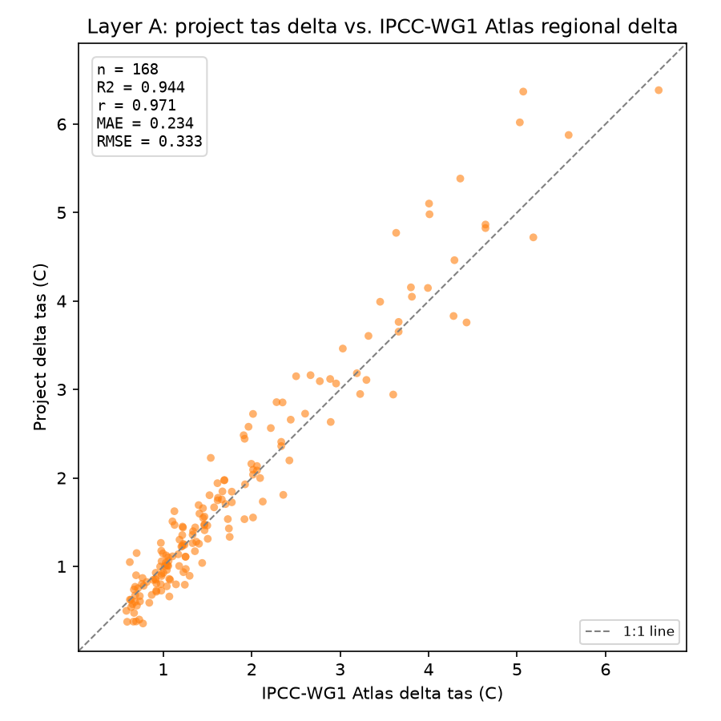
</p>

Bias = 0.051 C, limits of agreement = -0.597 C to 0.698 C, 1.96 standard
deviations either side of the bias. The bias matches the table above by
construction, the limits of agreement add the spread, showing that
almost every one of the 168 points falls within about six tenths of a
degree of the mean difference in either direction, consistent with the
0.234 C MAE already reported.

<p align="center">
  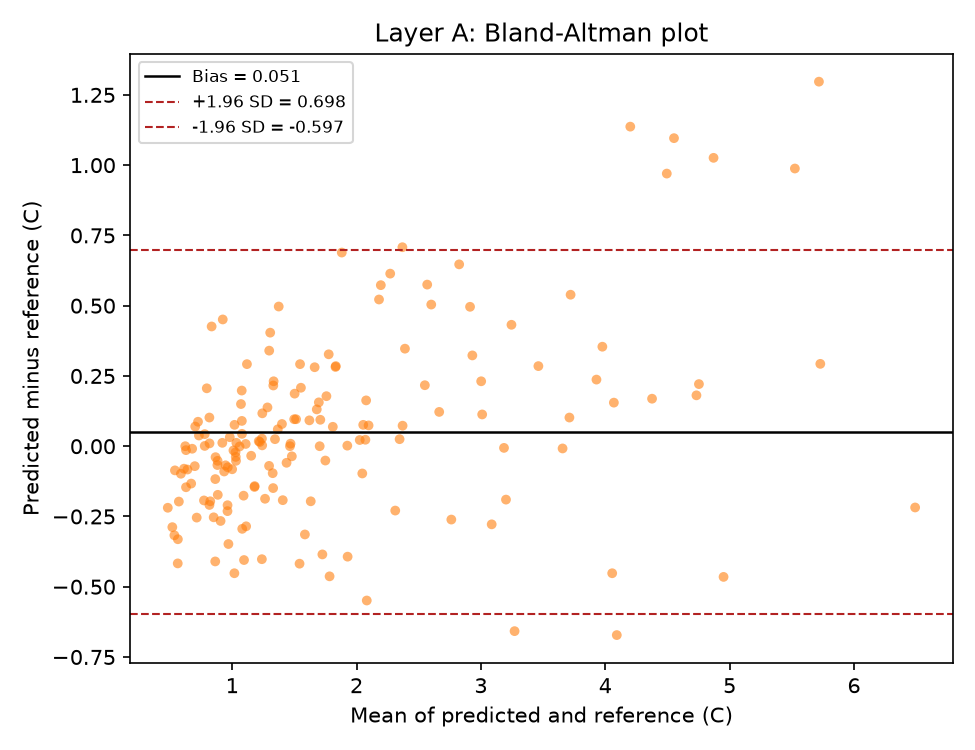
</p>

This table is generated, not hand copied. `compare_to_ipcc_atlas_multi.py`
writes the same numbers, plus a per city, SSP, and period breakdown, to
`results/layer_a_comparison_tas.csv` and
`results/layer_a_comparison_tas_summary.txt` when given `--output-csv`
and `--output-summary`:

```bash
python compare_to_ipcc_atlas_multi.py \
    --atlas-repo /path/to/atlas_repo \
    --report results/independent_verify_all_results.txt \
    --location-region Cairo:MED --location-region Chicago:ENA \
    --location-region London:NEU --location-region Moscow:WCE \
    --location-region Mumbai:SAS --location-region Nairobi:SEAF \
    --location-region Phoenix:NCA --location-region Rio_de_Janeiro:SES \
    --location-region Rome:MED --location-region Santiago:SWS \
    --location-region Singapore:SEA --location-region Sydney:EAU \
    --location-region Tehran:WCA --location-region Ulaanbaatar:ESB \
    --output-csv results/layer_a_comparison_tas.csv \
    --output-summary results/layer_a_comparison_tas_summary.txt
```

**Interpretation.** The correlation is very strong and stable between the
preliminary 3 city sample and the full 14 city sample, 0.973 versus 0.971,
which is itself a useful check, since a correlation that collapses when
more data is added would have suggested the first result was a
coincidence of which cities were picked. Wherever the Atlas shows a
larger delta, the project's own extraction shows a larger delta too, in
an almost linear relationship, which is exactly what a correct
implementation should produce when compared against a genuinely
different, coarser resolution, differently sourced dataset.

Unlike MAE, RMSE, and r, the bias changed substantially between the
preliminary and full sample, from +0.261 C down to +0.051 C, essentially
negligible. The earlier, smaller sample included Helsinki, where the
difference grew with warming magnitude, and this was read at the time as
a possible latitude linked pattern. The full 14 city sample does not
support that reading. Ulaanbaatar, a city just as high latitude and just
as continental as Helsinki, shows a bias in the opposite direction,
consistently negative rather than growing positive. Per city mean
differences across all 12 SSP and period combinations range from about
-0.4 C, London and Ulaanbaatar, to about +0.46 C, Moscow, with most
cities well inside that range and no clear grouping by latitude,
continentality, or hemisphere. This looks like ordinary point versus
region average scatter rather than a systematic effect, and the earlier
latitude hypothesis is retracted here rather than repeated, since the
data collected specifically to test it does not support it.

A 0.23 C mean absolute error, a bias of 0.05 C, and a Pearson r of 0.97 on
an out of sample, externally sourced, 168 point comparison, with no sign
flip and no order of magnitude mismatch anywhere in the sample, is a
solid validation result. Extending this comparison to the CDD, HDD, and
count index variables where the Atlas archive provides them would add
further confidence but is not required to consider the current result
sufficient.

### 16. Existing Self Consistency Benchmark, `validate_morphing.mjs`

**Method.** `validate_morphing.mjs` runs the app's real Shift and Stretch
morphing pipeline, through synced copies of `climate-morphing.js`,
`climate-tile-loader.js`, `peak-conditions.js`, `epw-parser.js`,
`psychrolib.js`, and `point-in-region.js`, on 14 sample EPW files spanning
the same Koppen climate diversity used elsewhere in the paper, across
every combination of the four CMIP6 scenarios and three target horizons,
for 168 city, scenario, and year combinations.

For each combination, four annual indices, frost days, tropical nights,
CDD, and HDD, are computed two independent ways from the same CMIP6 grid
cell: EPW derived, the delta between morphed and baseline EPW, via the
app's real Shift and Stretch code, against CMIP6 direct, the same index
as published directly by the CMIP6 gridded dataset, no morphing involved.

For CDD and HDD specifically, the EPW-derived side is computed with base
temperatures of 22C and 15.5C, matching the CMIP6-native cd/hd index
definition documented in the Copernicus Interactive Climate Atlas source
files (variable attribute `comment`, and the `threshold22c`/`threshold15_5c`
coordinates), per IPCC AR6 WGI Annex VI. This is not the platform's own
degree-day default (24C/18C, a user-adjustable ASHRAE-style convention
used elsewhere in the app for building energy analysis); an earlier
version of this comparison used that default on both sides, which meant
the two paths were being compared under different physical definitions of
a degree-day, on top of whatever the morphing method itself contributes.
Section 16.1 below covers what that correction changed, and what it did
not.

This is a self consistency check, not independent source validation, both
numbers trace back to the same underlying CMIP6 ensemble. Good agreement
means the morphing math is not introducing large errors of its own beyond
what CMIP6's inter-model spread already implies. It does not by itself
prove the morphed hourly data matches reality, which is what sections 14
and 15 address instead.

**Results, all 168 combinations:**

| Index | MAE | RMSE | Bias | MAPE | nRMSE | r | R squared |
|---|---|---|---|---|---|---|---|
| Frost days | 3.88 | 6.44 | +2.63 | 58.5 percent, 67 near zero excluded | 46.9 percent | 0.90 | 0.817 |
| Tropical nights | 8.29 | 13.90 | -3.91 | 49.5 percent, 19 excluded | 52.0 percent | 0.87 | 0.753 |
| Cooling degree days | 58.44 | 90.81 | -4.94 | 31.7 percent | 37.5 percent | 0.95 | 0.911 |
| Heating degree days | 58.57 | 89.24 | +48.83 | 34.8 percent, 25 excluded | 28.9 percent | 0.97 | 0.942 |

<p align="center">
  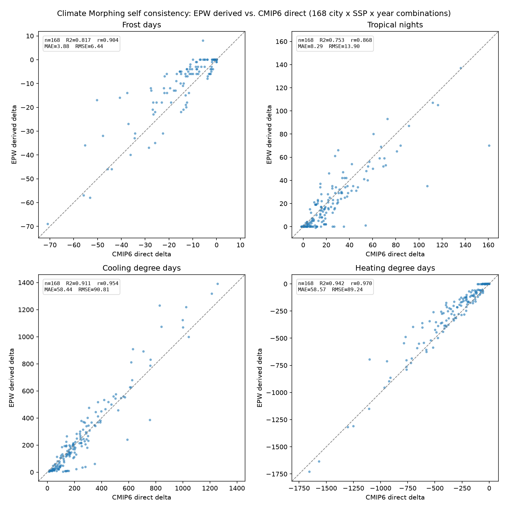
</p>

Correlation is consistently high, 0.87 to 0.97, across all four indices,
but MAPE and nRMSE are proportionally larger for the two threshold-count
indices than for the two cumulative indices: frost days (58.5 percent /
46.9 percent) and tropical nights (49.5 percent / 52.0 percent), against
CDD (31.7 percent / 37.5 percent) and HDD (34.8 percent / 28.9 percent).
Section 16.1 discusses the likely mechanism, day-to-day variance held
constant by Shift and Stretch, and extends it to all four indices, not
only HDD. Frost days and tropical nights are unaffected by the base-temperature
correction (they use fixed 0C/20C thresholds, not a configurable degree-day
base) and are unchanged from the original run. Full SSP and target year
breakdown is included in each saved per run summary file.

The Bland-Altman panels below make the bias visible directly rather than
inferring it from the sign of the table's Bias column.

<p align="center">
  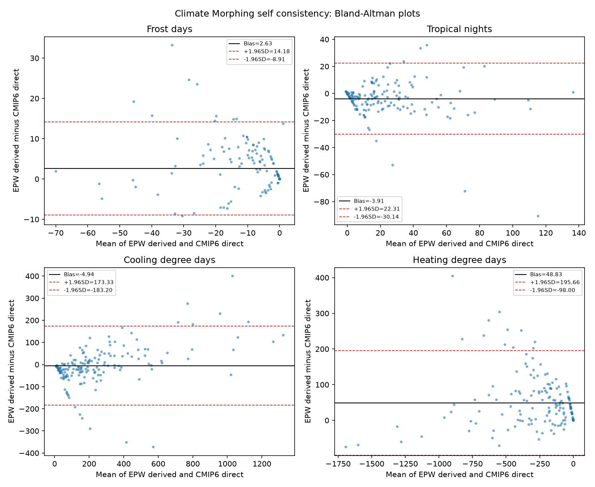
</p>

**Known, validated data characteristic, not a bug.** Heating degree days
under SSP2-4.5, SSP3-7.0, and SSP5-8.5 at the 2080 horizon is quantized at
a slightly reduced Int16 scale, offline tile pipeline, section 7, worst
case rounding of about plus or minus 0.05 to 0.07 degree days, negligible
next to deltas in the hundreds. `validate_precision_pipeline.py` already
accounts for this in its tolerances.

**How to run.**

```bash
npm run sync:all
node validate_morphing.mjs
```

Writes a timestamped CSV, all 168 by 4 rows, and a summary text file into
`results/` on each run, so earlier runs are never overwritten. The R
squared values and the figure in this section are computed from a copy
of that CSV saved under the fixed name `epwinsights_morphing_validation.csv`,
matching the corresponding fixed names already used for the UTCI, SET,
and MRT CSVs, so `generate_figures.py`, section 18, always has a stable
filename to read regardless of which timestamped run produced it.

### 16.1 Degree-Day Base-Temperature Correction and the Residual HDD Bias

The first version of this benchmark reported a large negative bias for
both CDD (-54.63) and HDD (-11.08).Investigating this directly, by inspecting the NetCDF metadata of
the CMIP6 source files rather than assuming a cause, found the cd/hd
variables are computed by the Copernicus Interactive Climate Atlas with
fixed base temperatures of 22C (cooling) and 15.5C (heating), per IPCC AR6
WGI Annex VI, not the platform's own 24C/18C default. Re-running the
comparison with the EPW-derived side matched to that same definition
(22C/15.5C, section 16 above) changed the two biases very differently:

| | Before correction | After correction |
|---|---|---|
| Cooling degree days Bias | -54.63 | -4.94 |
| Heating degree days Bias | -11.08 | +48.83 |

For CDD, the correction resolved the great majority of the original bias,
a 91 percent reduction, confirming the base-temperature mismatch was the
dominant cause. For HDD, the correction made the bias larger and flipped
its sign. This means the original, smaller HDD bias of -11.08 was not
evidence of good agreement; it was two effects of opposite sign
coincidentally cancelling, the same base-temperature mismatch that
dominates CDD, plus a second, larger, independent effect that only became
visible once the first was removed.

To put these post-correction biases in context against typical magnitudes
in this sample: CDD's -4.94 bias is -0.8 percent of the sample's mean
baseline CDD (584.7) and -2.6 percent of its median (192.3); HDD's +48.83
bias is 3.7 percent of the sample's mean baseline HDD (1310.7) and 7.1
percent of its median (687.8). Both values are computed from the same
168-row diagnose_hdd_bias.mjs run as the correlations below.

`diagnose_hdd_bias.mjs` investigates that second effect directly, testing
two specific hypotheses rather than speculating:

- **Ensemble disagreement.** Does the residual error correlate with how
  much the 22 CMIP6 models disagree with each other for that city, SSP,
  and period (the ensemble standard deviation already present in the
  delta data)? Result: yes, more so for HDD (r = 0.577, 95% CI 0.466 to
  0.670, n = 168) than for CDD (r = 0.381, 95% CI 0.244 to 0.503, n = 168).
  This difference is statistically significant (Steiger, 1980,
  dependent-correlations test, Z = 2.14, p = 0.033), computed from the
  full six-way correlation matrix among HDD error, CDD error, HDD
  ensemble std, and CDD ensemble std across the same 168 rows, not a
  naive independent-samples test. Where the models themselves disagree
  more, the EPW-derived and CMIP6-direct paths disagree more too. This
  points to the residual reflecting genuine, inherent CMIP6 ensemble
  uncertainty rather than a bug in this project's own code, and it is
  stronger for HDD, consistent with HDD's larger residual bias.
- **Cold-climate variability.** Shift and Stretch (section 5) shifts each
  day's mean temperature by a constant monthly delta; it does not, and by
  construction cannot, change the day-to-day variance of the historical
  temperature series, since a constant additive shift preserves variance
  exactly. CMIP6's own future-period cd/hd values, by contrast, are
  computed from the models' own simulated daily weather, which can carry
  a genuine change in day-to-day variance alongside the mean shift. Winter
  variability changes under warming are relatively well documented in the
  climate literature, so the specific hypothesis tested was that cold,
  continental cities (Chicago, Moscow, Ulaanbaatar, this project's Dfa/
  Dfb/Dwb Koppen classes) would show the largest residual HDD error.
  Result: no. The three largest per-city HDD errors are Santiago (BSk,
  206.5), Tehran (BSk, 157.8), and Phoenix (BWh, 97.0); the three
  Koppen-D cold-continental cities all fall in the better half of the
  ranking (Ulaanbaatar 52.5, Chicago 35.6, Moscow 34.2), with Ulaanbaatar
  showing the single largest per-city ensemble std (537.9) yet only the
  fourth-largest error. This specific mechanism is not supported by the
  data and is not presented as the explanation.

**Conclusion.** The residual HDD bias is real, is not attributable to a
further definitional mismatch (the same correction that nearly resolved
CDD did not resolve HDD), correlates with genuine CMIP6 inter-model
disagreement, and does not follow the specific cold-climate pattern a
Shift-and-Stretch variance-blindness argument would predict. Rather than
propose a second, unverified mechanism, this is documented here as an
open, quantified limitation: Shift and Stretch's inability to alter
day-to-day variance is a known, structural property of the method, likely
a contributing factor, but the exact reason its effect on HDD is larger
and geographically patterned differently than on CDD is not fully
resolved by this project's own data. See the manuscript, Section 4.2, and
"Known Limitations" below.

**Extension to frost days and tropical nights.** The same structural
property, a constant per-day shift cannot alter the historical day-to-day
variance, applies to any threshold-crossing index, not only HDD. Frost
days and tropical nights count individual daily exceedances rather than
summing a continuous quantity over the year, so they are, if anything,
more exposed to an unchanged day-to-day distribution than CDD or HDD are;
this is consistent with their higher MAPE and nRMSE in the section 16
table above. This general limitation of shift-and-stretch morphing, that
it preserves the change in monthly mean but not the day-to-day
distribution shape, is also documented independently in the building-science
morphing literature (Eames et al. 2024, Build Serv Eng Res Technol 45:5-20,
https://doi.org/10.1177/01436244231218861), which shows mathematically that
Belcher et al.'s original shift-and-stretch does not independently preserve
the projected change in daily maximum and minimum temperature, and
demonstrates the resulting effect on heating and cooling degree days
directly.

**How to run.**

```bash
node diagnose_hdd_bias.mjs
```

Reuses the same synced core modules and sample EPW files as section 16;
no separate sync step is required if `npm run sync:all` was already run.
Writes three timestamped files into `results/`: the same per-row CSV and
summary text as `validate_morphing.mjs`, plus a diagnostic report with the
correlation and per-city/per-climate-group breakdown referenced above.

### 17. Pipeline Version History

Recorded because the number of near duplicate `run_all_variables_*`
scripts had already caused confusion once. Established by direct file
comparison, not assumption.

`run_all_variables_2.py`, `_3.py`, and `_4.py` are byte for byte
identical. It is safe to delete `_3.py` and `_4.py` and keep `_2.py`
only.

Because `run_cdd_hdd.py` and `run_indices.py` write to the exact same
output filenames as the original `_2.py` run, their corrected output
should have overwritten the wrong values before `merge_deltas.py` ran.
This is exactly what section 14.5 verified end to end for HDD, FD, TX35,
TX40, tropical nights, and TXx at ssp245 and 2050, all of which matched
the independent recomputation to the quantization floor. Confidence in
this conclusion is now high, backed by data, not only by reading the
script comments.

`build_climate_database.py`, section 8.1, correctly passes `--mode` in
all cases going forward, so this class of bug cannot recur through the
new orchestrated pipeline.

### 18. Figures: `generate_figures.py`

Every figure embedded in this document, sections 1 and 13 through 16, is
produced by one script, `generate_figures.py`, which reads the already
existing CSV outputs of the other validation scripts and computes Pearson
r, R squared, and Bland-Altman bias and limits of agreement directly from
the paired reference and predicted values in each one. It runs no
validation itself and duplicates no formula from any other script.

Two figure types are produced for each comparison: a predicted versus
reference scatter plot with a 1:1 line, and a Bland-Altman plot, the
difference between the two methods plotted against their mean, with the
bias and the 1.96 standard deviation limits of agreement marked. The
scatter plot is the more familiar format and is what R squared and
Pearson r describe; the Bland-Altman plot is the more appropriate one for
judging absolute agreement, section 1's closing note explains why the two
are not interchangeable.

```bash
pip install matplotlib numpy
python generate_figures.py \
    --results-dir results \
    --cmip6-results-dir cmip6-extraction-crosscheck/results \
    --output-dir results/figures
```

Any input CSV that is missing is skipped with a printed warning rather
than stopping the run, so this can be used after only some of the other
validation scripts have been re run. Twelve figures are produced: a
scatter plot and a Bland-Altman plot for each of UTCI, SET, MRT,
SolarCal core (ERF and t_rsw together in one two-panel figure), and
Layer A, `utci_scatter.png` and `utci_bland_altman.png` and so on, plus
one composite scatter figure and one composite Bland-Altman figure for
the Climate Morphing self consistency benchmark, four panels each, one
per index, `morphing_self_consistency_scatter.png` and
`morphing_self_consistency_bland_altman.png`.

Unlike the scripts in `cmip6-extraction-crosscheck/`, `generate_figures.py`
needs no machine specific path when run from the `validation/` folder
with its default arguments, since it only reads files already inside the
repository. It is still a standalone Python tool, not a `package.json`
entry, since the rest of this repository's Node scripts have no reason to
depend on a Python and matplotlib installation.

---

## Supplementary: Computational Performance Benchmark

This section measures speed and memory use. It does not check correctness
against any reference and is not part of the validation layering described
in Parts 1 and 2 above.

### Method

`measure_performance.mjs` imports and calls the same three project
functions a real session exercises when a file is loaded and the Outdoor
Comfort and Material Analysis tabs are opened: `parseEPW()`
(`core/epw-parser.js`), the per-hour `calculateAdvancedMRT()` /
`calculateUTCI()` / `calculateSET()` sequence (`core/outdoor-comfort.js`,
the same order used in `charts/outdoor-comfort-charts.js`), and
`computeMaterialTemperatures()` plus `computeThermalMass1D()`
(`core/material-physics.js`). It runs on the same 14 sample EPW files used
throughout Part 2 (`public/epw/`), so the reported figures are a mean and
range across climates, not a single arbitrary file.

Before timed measurement starts, the full pipeline runs twice on one
city, discarded, to let V8 finish JIT-optimizing the hot functions first;
without this, the first one or two cities in the timed loop showed
inflated times reflecting interpreter execution, not the platform's
steady-state speed.

This measures pure Node.js computation only, no browser, no DOM, no chart
rendering, and no network fetch of Climate Morphing's CMIP6 tiles, since
`climate-tile-loader.js` depends on browser `fetch()` against files served
by the Vite dev server and is not exercised here. It is a lower bound on
real in-browser time, not a substitute for it.

### Browser measurement

For a figure that also reflects real in-browser use (DOM updates and D3
chart rendering), start from a freshly loaded page, open the browser
console, and run:

```js
const overlay = document.getElementById('global-processing-overlay');
let startMark = null;
const observer = new MutationObserver(() => {
  const isActive = overlay.classList.contains('processing-active');
  if (isActive && !startMark) {
    startMark = performance.now();
  } else if (!isActive && startMark) {
    const duration = performance.now() - startMark;
    console.log(duration.toFixed(1), 'ms');
    console.log('heap used (MB):', performance.memory ? (performance.memory.usedJSHeapSize / 1048576).toFixed(1) : 'not available');
    startMark = null;
  }
});
observer.observe(overlay, { attributes: true, attributeFilter: ['class'] });
```

Then load an EPW file and click the Outdoor Comfort tab. The observer
brackets exactly the interval between the app's own
`showGlobalProcessing()` and `hideGlobalProcessing()` calls (`app.js`),
so the reading is not contaminated by however long the user takes to
find and click the tab, and no second manual mark is needed.
`performance.memory` is Chrome-specific, so this was run in Chrome only.
Only the first measurement in a freshly loaded session (no file loaded
yet) reflects the memory cost of a single file; repeating the
measurement in the same tab without reloading the page accumulates
previously loaded files' data and inflates the heap reading, so only
that first reading is reported for memory.

### How to run

```bash
npm run sync:core
node measure_performance.mjs
```

Writes `epwinsights_performance_benchmark.txt` (full per-city breakdown
plus summary) and `epwinsights_performance_benchmark.csv` (machine
readable) into `results/` on each run, overwriting the previous run,
matching how the rest of `results/` is treated elsewhere in this document.

### Results

Node.js computation, mean and range across the 14 cities, i7-4702MQ
(2.20 GHz, 16 GB RAM):

| Stage | Mean (ms) | Range (ms) |
|---|---|---|
| Parse | 83 | 79 to 89 |
| Outdoor Comfort (MRT + UTCI + SET, full year) | 99 | 96 to 109 |
| Material Analysis (steady-state + 1D thermal mass) | 187 | 143 to 245 |
| Total | 370 | 320 to 442 |

Peak Node.js heap observed across the run: 82 to 114 MB (varied slightly
between separate runs; this is process-wide heap across all 14 cities
processed sequentially, not the cost of any single file in isolation).

Browser, Chrome, same machine: opening the Outdoor Comfort tab after
loading a file (computation plus D3 chart rendering) took a mean of
531 ms (range 478 to 608 ms) across 70 measurements, 5 repeats for each
of the 14 city files, using the method above. A JavaScript heap of about
41 MB was recorded for a single file in a freshly loaded session; later
readings within the same session were higher, reflecting several files'
data accumulated in memory rather than the cost of any one file. Raw
per-trial values are in
`results/epwinsights_browser_performance_benchmark.csv`.

### Known limitations

- Single machine, single browser (Chrome). Not tested on markedly weaker
  hardware (e.g. a low-end phone) or another browser engine.
- Climate Morphing is not included, for the network-dependency reason
  given above.
- The browser figure comes from 70 manual measurements, this document's
  largest sample, but the measurement procedure itself is still a manual
  console step rather than an automated, repeatable script, unlike every
  other result in this document.

---

## Appendix: Folder Layout

### Validation repository (`validation/`)

```
validation/
    README.md
    package.json
    sync-core.sh
    sync-morphing.sh
    state.js
    core/
        climate-morphing.js
        climate-tile-loader.js
        date-filter.js
        epw-parser.js
        material-physics.js
        outdoor-comfort.js
        peak-conditions.js
        point-in-region.js
        psychrolib.js
        sky-temperature.js
        suncalc.js
    diagnose_hdd_bias.mjs
    generate_figures.py
    measure_performance.mjs
    validate_ground_temp_linearization.mjs
    validate_ground_temp_plausibility.mjs
    validate_hr_linearization_accuracy.mjs
    validate_morphing.mjs
    validate_morphing_analysis_synthetic.mjs
    validate_morphing_synthetic.mjs
    validate_mrt.mjs
    validate_mrt_c4.mjs
    validate_set.mjs
    validate_sharp_sensitivity.mjs
    validate_utci.mjs
    data/
      epwinsights_14city_peak_ghi_extract.csv
      epwinsights_14city_peak_ghi_window.csv
      epwinsights_mrt_c4_validation.csv
      epwinsights_mrt_validation.csv
      epwinsights_set_validation.csv
      UTCI-Test-Data.README.txt
      UTCI-Test-Data.txt
    results/
        epwinsights_set_validation_rerun.csv
        epwinsights_utci_validation.csv
        epwinsights_ground_temp_linearization_error.csv
        epwinsights_ground_temp_plausibility.csv
        epwinsights_hr_linearization_accuracy.csv
        epwinsights_hr_linearization_worst_cases.csv
        epwinsights_morphing_hdd_diagnostic.txt
        epwinsights_hdd_cdd_paired.csv
        epwinsights_morphing_validation.csv
        epwinsights_morphing_validation_summary.txt
        epwinsights_stretch_clamp_summary.txt
        epwinsights_sharp_sensitivity.csv
        epwinsights_mrt_validation_rerun.csv
        epwinsights_mrt_c4_validation_rerun.csv
        epwinsights_browser_performance_benchmark.csv
        epwinsights_performance_benchmark.csv
        epwinsights_performance_benchmark.txt
        figures/
            layer_a_bland_altman.png
            layer_a_scatter.png
            morphing_self_consistency_bland_altman.png
            morphing_self_consistency_scatter.png
            mrt_bland_altman.png
            mrt_scatter.png
            set_bland_altman.png
            set_scatter.png
            solarcal_core_bland_altman.png
            solarcal_core_scatter.png
            utci_bland_altman.png
            utci_scatter.png
    cmip6-extraction-crosscheck/
        check_plausibility.py
        compare_to_ipcc_atlas.py
        compare_to_ipcc_atlas_multi.py
        decode_and_compare.py
        independent_verify_all.py
        independent_verify_delta.py
        results/
            independent_verify_all_results.txt
            layer_a_comparison_tas.csv
            layer_a_comparison_tas_summary.txt
```

`generate_journal_figure.py` is a separate, standalone script used only to
produce the single print-ready composite figure for the paper itself
(Figure 10, Section 4.1), styled differently from the figures embedded in
this README. It reads the same `results/*.csv` files as
`generate_figures.py` but duplicates none of its plotting code, and its
file paths are hardcoded to this machine rather than passed as arguments,
since it is not meant to run in other environments.

`generate_figures.py` reads from both `results/` and
`cmip6-extraction-crosscheck/results/` and writes only into
`results/figures/`, so it is listed here at the top level rather than
inside `cmip6-extraction-crosscheck/`, even though one of its five inputs
comes from that folder.

`cmip6-extraction-crosscheck/results/` is a separate folder from the top
level `validation/results/`, since the two hold outputs from different
runtimes, Python here versus Node.js there, with different naming
conventions. Both are safe to regenerate and hold only the most recent
run, not a full history. 

None of the Python scripts in `cmip6-extraction-crosscheck/` have
`package.json` entries, unlike the Node scripts above, since every one of
them requires a machine specific path, `--netcdf-root`, `--atlas-repo`,
or `--data-dir`, that cannot be hardcoded into a portable npm script. The
exact commands are given in sections 14.6 and 15 instead.

`compare_to_ipcc_atlas.py` and `compare_to_ipcc_atlas_multi.py` also
require a local sparse checkout of `github.com/IPCC-WG1/Atlas`, not
vendored into this repository, see section 15 for the clone command. It
is external, officially published IPCC data, not a copy of anything
belonging to this project.

The 14 sample EPW files used by the self consistency benchmark, section
16, are not duplicated here. They live in the main app's `public/epw/`,
and `validate_morphing.mjs` reads them from there directly.

### Main app repository, CMIP6 build pipeline (`scripts/tile-generation/`)

These are offline, one time per CMIP6 release scripts, not part of the
app's runtime bundle, and are not synced from or to `validation/core/`
since nothing here executes in the browser.

```
scripts/tile-generation/
    extract_climate_deltas.py
    merge_deltas.py
    build_climate_tiles.py
    build_climate_database.py
    run_cdd_hdd.py
    run_indices.py
    validate_precision_pipeline.py
```
